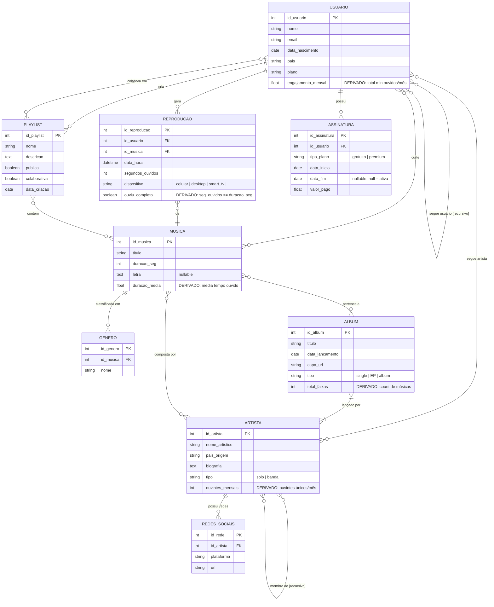

# DER — Plataforma de Streaming Musical (estilo Spotify)
> Notação: Mermaid `erDiagram` · Resolução completa do desafio

---

## Diagrama Entidade-Relacionamento

---

## Legenda de Cardinalidade (Mermaid)

| Símbolo Mermaid | Leitura                        |
|-----------------|--------------------------------|
| `\|\|`          | Exatamente um (mandatório)     |
| `o\|`           | Zero ou um (opcional)          |
| `\|{`           | Um ou mais (mandatório)        |
| `o{`            | Zero ou mais (opcional)        |
| `}o--o{`        | N:M parcial nos dois lados     |
| `\|\|--o{`      | 1:N — um lado total, outro parcial |
| `}o--\|\|`      | N:1 — lado N parcial, lado 1 total |

---

## Atributos Especiais

### Derivados *(não armazenados — calculados sob demanda)*

| Entidade      | Atributo             | Fórmula                                      |
|---------------|----------------------|----------------------------------------------|
| `USUARIO`     | `engajamento_mensal` | Σ `segundos_ouvidos` / 60 no mês corrente    |
| `ARTISTA`     | `ouvintes_mensais`   | COUNT DISTINCT `id_usuario` em REPRODUCAO/mês |
| `MUSICA`      | `duracao_media`      | AVG `segundos_ouvidos` em REPRODUCAO         |
| `ALBUM`       | `total_faixas`       | COUNT músicas vinculadas ao álbum            |
| `REPRODUCAO`  | `ouviu_completo`     | `segundos_ouvidos >= duracao_seg` da música  |

### Multivalorados *(representados como entidades auxiliares no Mermaid)*

| Entidade  | Atributo original | Entidade auxiliar  |
|-----------|-------------------|--------------------|
| `ARTISTA` | `{redes_sociais}` | `REDES_SOCIAIS`    |
| `MUSICA`  | `{generos}`       | `GENERO`           |

> **Nota:** A notação Chen representa multivalorados com elipse dupla. No Mermaid `erDiagram`, a convenção é criar uma entidade auxiliar ligada por 1:N.

---

## Relacionamentos com Atributos Próprios

| Relacionamento            | Atributos                    |
|---------------------------|------------------------------|
| `USUARIO — cria — PLAYLIST`        | `data_criacao`               |
| `USUARIO — colabora em — PLAYLIST` | `data_entrada`               |
| `USUARIO — curte — MUSICA`         | `data_curtida`               |
| `USUARIO — segue — ARTISTA`        | `data_inicio`                |
| `USUARIO — segue — USUARIO`        | `data_inicio`                |
| `PLAYLIST — contém — MUSICA`       | `ordem`, `data_adicao`       |
| `MUSICA — pertence a — ALBUM`      | `faixa_numero`               |
| `ALBUM — lançado por — ARTISTA`    | `papel` (principal/featuring)|
| `MUSICA — composta por — ARTISTA`  | `papel` (principal/featuring)|
| `ARTISTA — membro de — ARTISTA`    | `data_entrada`, `data_saida` |

> **Nota:** O Mermaid `erDiagram` não suporta atributos em relacionamentos nativamente. Em uma implementação real, esses relacionamentos N:M viram **tabelas associativas** com os atributos listados.

---

## Pontos de Destaque da Resolução

### Entidade Fraca — `REPRODUÇÃO`
`REPRODUCAO` é uma entidade fraca pois **sua existência depende simultaneamente de `USUARIO` e `MUSICA`**. Sem um usuário ou sem uma música referenciada, uma reprodução não tem sentido semântico. Na notação Chen, seria representada com retângulo de borda dupla.

### Relacionamentos Recursivos
- **`USUARIO — segue — USUARIO`**: auto-relacionamento N:M com papéis *seguidor* e *seguido*, ambos opcionais — um usuário pode não seguir ninguém e pode não ser seguido por ninguém.
- **`ARTISTA — membro de — ARTISTA`**: modela bandas sem criar uma entidade separada. Os atributos `data_entrada` e `data_saida` permitem rastrear o histórico de formações.

### Decisão de Modelagem — `REPRODUÇÃO` como Entidade vs. Relacionamento
Embora `REPRODUCAO` possa ser vista inicialmente como um relacionamento entre `USUARIO` e `MUSICA`, ela é modelada como **entidade** porque possui atributos próprios relevantes (`data_hora`, `segundos_ouvidos`, `dispositivo`) e é consultada de forma independente (histórico de plays, analytics). Relacionamentos com muitos atributos e que precisam ser referenciados diretamente devem virar entidades.

### Distinção `cria` vs. `colabora em`
São dois relacionamentos distintos entre `USUARIO` e `PLAYLIST` para separar o **dono** (que tem controle total, participação mandatória) dos **colaboradores** (opcionais, presentes apenas em playlists colaborativas).
