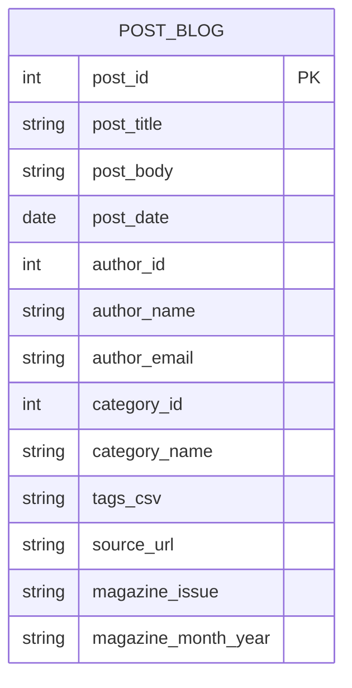
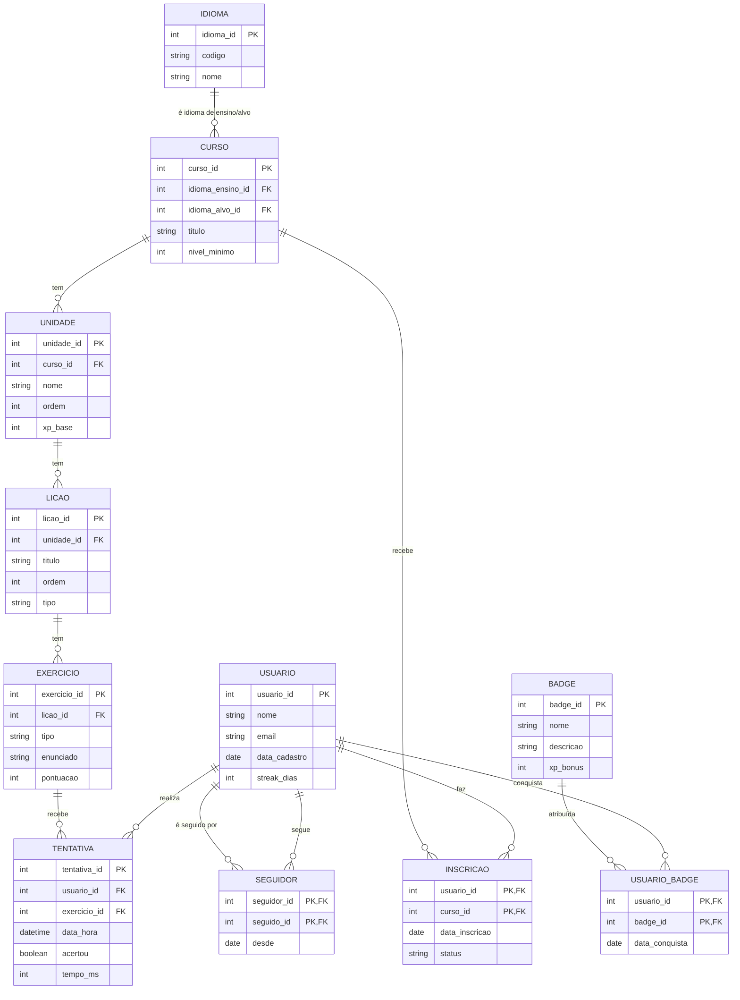
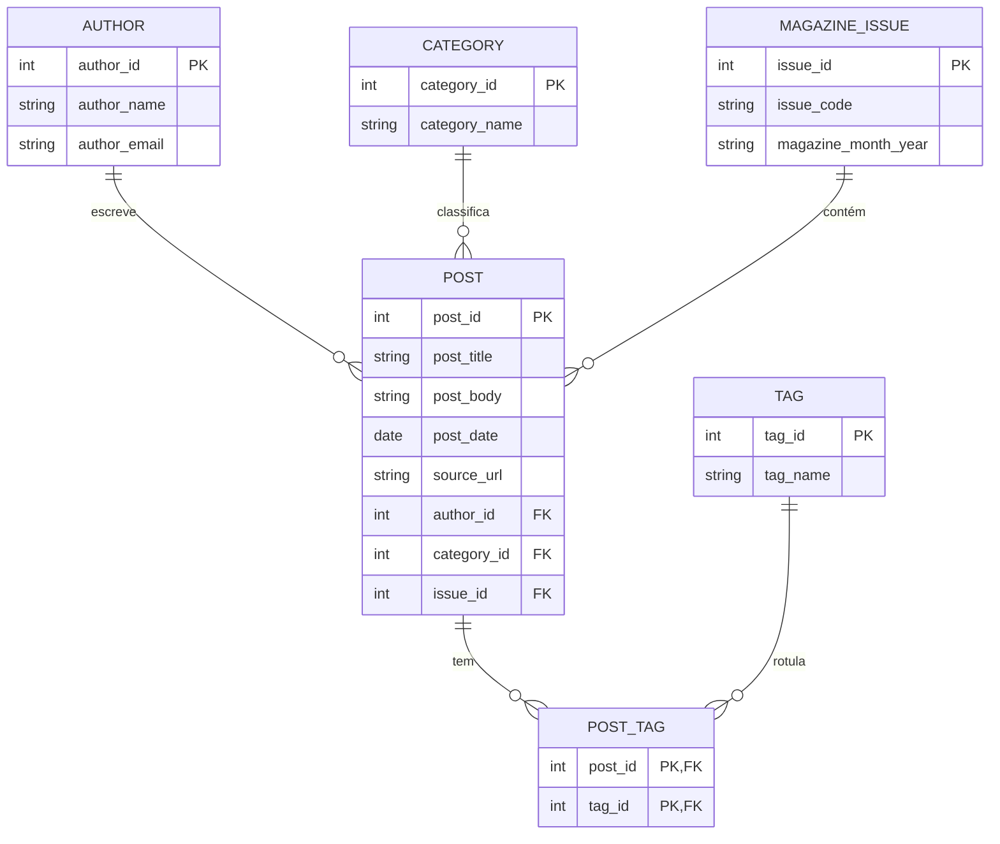

# Prova Presencial — Banco de Dados 1 (SENAC)  
**Curso:** Ciência da Computação — 2º semestre  
**Disciplina:** Banco de Dados 1  
**Duração:** 2h  
**Data:** 17/09/2025  
**Valor total:** 10,0 pontos (+ **Bônus 2,0 pts**)

## Instruções Gerais
- Responda **à caneta** (azul ou preta).  
- Entregue a folha com **nome completo e RA**.  
- É permitido apenas **material impresso** (sem dispositivos eletrônicos).  
- Onde solicitado, **justifique** escolhas de chaves e restrições.  
- Use notação clara para: **superchave, chave candidata, chave primária e chave composta**.

---

## Exercício 1 — Modelagem Relacional do “Duolingo” (5,0 pts)

### Contexto (Cenário)
Uma plataforma de aprendizado de idiomas oferece **cursos** compostos por **unidades (skills)**; cada unidade contém **lições** com **exercícios** (p. ex., múltipla escolha, completar frase, ouvir e transcrever).  
Usuários podem se **inscrever** em cursos, acumulam **XP**, mantêm **streak diária**, e cada tentativa de exercício registra **acerto/erro**, **tempo gasto** e **data/hora**.  
Cursos têm **idioma de ensino** (ex.: pt-BR) e **idioma-alvo** (ex.: en-US). Há **badges** que são concedidas ao atingir metas (p. ex., “7 dias de streak”, “1000 XP”); usuários podem **seguir** outros usuários.

### Requisitos (o que você deve identificar e modelar)
1. **Tabelas e atributos** (mínimo **5 tabelas** e **5 campos** por tabela) para cobrir:
   - Usuários, Cursos, Unidades/Skills, Lições, Exercícios, Inscrições, Tentativas, Idiomas, Badges, Seguidores (escolha um subconjunto suficiente).
2. **Relacionamentos** (1:N, N:M quando aplicável) e **cardinalidades**.
3. **Chaves**: superchaves, chaves candidatas, chave primária (PK), chaves compostas quando existirem, e chaves estrangeiras (FK).
4. **Restrições** de atributos (ex.: NOT NULL, UNIQUE, domínios, faixas min–max, checagens lógicas).
5. **Regras de integridade** (ex.: um Curso deve referenciar um idioma de ensino e um idioma-alvo distintos).

### Entregáveis
- Lista das **tabelas** com **atributos** e **tipos** (pode ser pseudotipo).
- Indicação clara de **PK**, **FK**, **UNIQUE**, **CHECK** (min–max), **NOT NULL**.
- Identificação de **superchaves** e **chaves candidatas** por tabela (texto curto).
- Desenho do **modelo relacional** (pode ser textual/tabela; diagrama opcional).

### Critérios de Avaliação (5,0 pts)
- (1,5) Cobertura correta do cenário com tabelas e atributos (≥5/5).  
- (1,0) Relacionamentos e cardinalidades corretas.  
- (1,5) Identificação de chaves (super, candidatas, PK, compostas) com justificativa.  
- (0,5) Restrições de integridade (NOT NULL, UNIQUE, CHECK min–max).  
- (0,5) Clareza e organização.

---

## Exercício 2 — Normalização de um “Blog PCMag” Simplificado (5,0 pts)

### Esquema **inicial** (com problemas)
Considere a tabela única abaixo, usada para posts, autores, categorias e tags (denormalizada):

```
POST_BLOG(
  post_id, post_title, post_body, post_date,
  author_id, author_name, author_email,
  category_id, category_name,
  tags_csv,          -- exemplo: "hardware;review;gpu"
  source_url, magazine_issue, magazine_month_year
)
```

**Observações:**
- Um post pode ter **múltiplas tags** (armazenadas em `tags_csv`).  
- Um autor pode escrever **vários posts**.  
- Uma categoria pode conter **vários posts**.  
- Alguns posts fazem parte de uma **edição da revista** (`magazine_issue`, `magazine_month_year`), outros não.

### Tarefas
1. **Identifique anomalias** de inserção/atualização/remoção e **dependências funcionais** prováveis.  
2. **Normalize** o esquema até **3FN** (ou **BCNF**, se possível), **criando as tabelas necessárias** (autores, categorias, tags, posts, ponte Post–Tag, edições da revista).  
3. Indique **PKs, FKs, UNIQUE** e quaisquer **CHECK** relevantes.  
4. Desenhe um **diagrama** (Mermaid) do esquema **normalizado**.  
5. Explique brevemente **como sua decomposição elimina as anomalias**.

### Diagrama do esquema **inicial** (Mermaid)
> Apenas para referência visual do problema (uma tabela “tudo em um”):



---

# BÔNUS (2,0 pts) — Modelo Entidade-Relacionamento (MER)

> **Objetivo:** Para **cada** exercício, elabore um **diagrama ER** completo, identificando **entidades, atributos, relacionamentos, cardinalidades (1:1, 1:N, N:M)** e **participação** (total/parcial). Quando apropriado, identifique **atributos-chave**, **atributos multivalorados/derivados**, **entidades fracas** e **entidades-associação**.

## Bônus A (1,0 pt) — MER do “Duolingo”

### O que entregar
1. **Entidades** (ex.: `USUARIO`, `IDIOMA`, `CURSO`, `UNIDADE`, `LICAO`, `EXERCICIO`, `INSCRICAO`, `TENTATIVA`, `BADGE`, `USUARIO_BADGE`, `SEGUIDOR`).  
2. **Atributos-chave** (identificar a chave de cada entidade) e **atributos relevantes** (ex.: `email`, `streak_dias`, `tipo`, `xp_base`).  
3. **Relacionamentos** com **cardinalidades** e **participação**:  
   - `CURSO` —(1:N)→ `UNIDADE` —(1:N)→ `LICAO` —(1:N)→ `EXERCICIO`  
   - `USUARIO` —(N:M)→ `CURSO` via `INSCRICAO` (com atributos como `status`, `data_inscricao`)  
   - `USUARIO` —(N:M)→ `BADGE` via `USUARIO_BADGE` (com `data_conquista`)  
   - `USUARIO` —(auto N:M)→ `USUARIO` via `SEGUIDOR`  
   - `USUARIO` —(N:M)→ `EXERCICIO` via `TENTATIVA` (com `acertou`, `tempo_ms`, `data_hora`)  
   - `CURSO` —(1:1)*→ `IDIOMA` (ensino) e —(1:1)*→ `IDIOMA` (alvo) — **garantir idiomas distintos**  
4. **Restrições semânticas** no diagrama (texto curto ao lado): ex. *“idioma_ensino ≠ idioma_alvo”*, *“ordem ≥ 1”*, *“streak_dias ≥ 0”*.

### Checklist de avaliação (1,0 pt)
- (0,4) Cobertura de entidades e atributos-chave.  
- (0,3) Relacionamentos, cardinalidades e participação corretos.  
- (0,2) Indicação de regras/observações (ex.: idiomas distintos; atributos derivados/multivalorados, se houver).  
- (0,1) Legibilidade e organização do diagrama.

> **Opcional (visual de referência no gabarito):**


## Bônus B (1,0 pt) — MER do “Blog PCMag” (a partir da normalização)

### O que entregar
1. **Entidades** derivadas do esquema normalizado: `AUTHOR`, `CATEGORY`, `MAGAZINE_ISSUE` (opcional), `POST`, `TAG`, `POST_TAG`.  
2. **Atributos** essenciais e **chaves**.  
3. **Relacionamentos** e **cardinalidades**:  
   - `AUTHOR` —(1:N)→ `POST`  
   - `CATEGORY` —(1:N)→ `POST`  
   - `MAGAZINE_ISSUE` —(1:N)→ `POST` (participação parcial de `POST`)  
   - `POST` —(N:M)→ `TAG` via `POST_TAG`  
4. Observações de integridade (ex.: *“tag_name é UNIQUE”*, *“issue opcional”*).

### Checklist de avaliação (1,0 pt)
- (0,4) Entidades e chaves coerentes com a normalização.  
- (0,3) Relacionamentos N:M e 1:N corretos, com cardinalidades explícitas.  
- (0,2) Observações de integridade consistentes (UNIQUE/participação).  
- (0,1) Clareza do diagrama.

> **Opcional (visual de referência no gabarito):**


---

# Gabarito / Correção

> **Nota:** Existem múltiplas boas soluções. Abaixo está **uma** proposta consistente.

## Exercício 1 — Possível Modelo Relacional “Duolingo”

### Tabelas (sugestão com ≥5/5 atendido)

**USUARIO**  
- `usuario_id` (PK)  
- `nome` (NOT NULL)  
- `email` (UNIQUE, NOT NULL)  
- `data_cadastro` (NOT NULL)  
- `streak_dias` (CHECK `streak_dias >= 0`, NOT NULL)  

**IDIOMA**  
- `idioma_id` (PK)  
- `codigo` (UNIQUE, NOT NULL) — ex.: `en-US`, `pt-BR`  
- `nome` (NOT NULL)  
- `familia` (NULLABLE)  
- `direcao_escrita` (CHECK IN {`LTR`,`RTL`}, NOT NULL)

**CURSO**  
- `curso_id` (PK)  
- `idioma_ensino_id` (FK → IDIOMA.idioma_id, NOT NULL)  
- `idioma_alvo_id`  (FK → IDIOMA.idioma_id, NOT NULL, **CHECK** diferente de `idioma_ensino_id`)  
- `titulo` (NOT NULL)  
- `nivel_minimo` (CHECK `nivel_minimo BETWEEN 0 AND 10`, NOT NULL)

**UNIDADE** (skill)  
- `unidade_id` (PK)  
- `curso_id` (FK → CURSO.curso_id, NOT NULL)  
- `nome` (NOT NULL)  
- `ordem` (CHECK `ordem >= 1`, NOT NULL)  
- `xp_base` (CHECK `xp_base >= 0`, NOT NULL)

**LICAO**  
- `licao_id` (PK)  
- `unidade_id` (FK → UNIDADE.unidade_id, NOT NULL)  
- `titulo` (NOT NULL)  
- `ordem` (CHECK `ordem >= 1`, NOT NULL)  
- `tipo` (CHECK IN {`prática`,`teoria`}, NOT NULL)

**EXERCICIO**  
- `exercicio_id` (PK)  
- `licao_id` (FK → LICAO.licao_id, NOT NULL)  
- `tipo` (CHECK IN {`multipla_escolha`,`listen_write`,`tradução`}, NOT NULL)  
- `enunciado` (NOT NULL)  
- `pontuacao` (CHECK `pontuacao IN (5,10,15,20)`, NOT NULL)

**INSCRICAO_CURSO**  
- `usuario_id` (FK → USUARIO.usuario_id, NOT NULL)  
- `curso_id` (FK → CURSO.curso_id, NOT NULL)  
- `data_inscricao` (NOT NULL)  
- `status` (CHECK IN {`ativo`,`concluido`,`trancado`}, NOT NULL)  
- **PK composta**: (`usuario_id`, `curso_id`)

**TENTATIVA_EXERCICIO**  
- `tentativa_id` (PK)  
- `usuario_id` (FK → USUARIO.usuario_id, NOT NULL)  
- `exercicio_id` (FK → EXERCICIO.exercicio_id, NOT NULL)  
- `data_hora` (NOT NULL)  
- `acertou` (BOOLEAN, NOT NULL)  
- `tempo_ms` (CHECK `tempo_ms >= 0`, NOT NULL)

**BADGE**  
- `badge_id` (PK)  
- `nome` (UNIQUE, NOT NULL)  
- `descricao` (NOT NULL)  
- `criteria` (NOT NULL)  
- `xp_bonus` (CHECK `xp_bonus >= 0`, NOT NULL)

**USUARIO_BADGE**  
- `usuario_id` (FK → USUARIO.usuario_id, NOT NULL)  
- `badge_id` (FK → BADGE.badge_id, NOT NULL)  
- `data_conquista` (NOT NULL)  
- **PK composta**: (`usuario_id`, `badge_id`)

**SEGUIDOR** (seguir usuários)  
- `seguidor_id` (FK → USUARIO.usuario_id, NOT NULL)  
- `seguido_id`  (FK → USUARIO.usuario_id, NOT NULL, **CHECK** `seguidor_id <> seguido_id`)  
- `desde` (NOT NULL)  
- **PK composta**: (`seguidor_id`, `seguido_id`)

### Chaves (exemplos)
- **USUARIO**:  
  - Superchaves: {`usuario_id`, …}, {`email`, …}  
  - Candidatas: {`usuario_id`}, {`email`}  
  - **PK**: `usuario_id`
- **INSCRICAO_CURSO**:  
  - Superchaves: {`usuario_id`,`curso_id`, …}  
  - Candidata: {`usuario_id`,`curso_id`}  
  - **PK composta**: (`usuario_id`,`curso_id`)
- Similar para **USUARIO_BADGE** e **SEGUIDOR**.

### Restrições (amostras)
- **UNIQUE**: `USUARIO.email`, `IDIOMA.codigo`, `BADGE.nome`.  
- **NOT NULL** conforme indicado.  
- **CHECK**: faixas (`streak_dias >= 0`), domínios (`tipo`), relacionais (idiomas distintos no curso).

---

## Exercício 2 — Normalização (Proposta até 3FN/BCNF)

### 1) Dependências e anomalias no esquema inicial
**Dependências prováveis**:  
- `post_id → post_title, post_body, post_date, source_url, magazine_issue, magazine_month_year, author_id, author_name, author_email, category_id, category_name, tags_csv`  
- `author_id → author_name, author_email`  
- `category_id → category_name`  
- `magazine_issue, magazine_month_year → (descrição da edição, opcional)`  

**Anomalias**:  
- **Inserção**: não se cadastra uma nova `category_name` sem criar `post`.  
- **Atualização**: mudança do `author_email` em um post não atualiza os demais.  
- **Remoção**: deletar o único post de uma categoria remove informação da categoria.  
- **Multivalorado**: `tags_csv` fere 1FN (lista em um campo).

### 2) Esquema **normalizado** (3FN/BCNF)

**AUTHOR**  
- `author_id` (PK)  
- `author_name` (NOT NULL)  
- `author_email` (UNIQUE, NOT NULL)

**CATEGORY**  
- `category_id` (PK)  
- `category_name` (UNIQUE, NOT NULL)

**MAGAZINE_ISSUE** (opcional)  
- `issue_id` (PK)  
- `issue_code` (UNIQUE, NOT NULL) — ex.: `2025-09`  
- `magazine_month_year` (NOT NULL)

**POST**  
- `post_id` (PK)  
- `post_title` (NOT NULL)  
- `post_body` (NOT NULL)  
- `post_date` (NOT NULL)  
- `source_url` (NULLABLE)  
- `author_id` (FK → AUTHOR.author_id, NOT NULL)  
- `category_id` (FK → CATEGORY.category_id, NOT NULL)  
- `issue_id` (FK → MAGAZINE_ISSUE.issue_id, NULLABLE)

**TAG**  
- `tag_id` (PK)  
- `tag_name` (UNIQUE, NOT NULL)

**POST_TAG** (relação N:M)  
- `post_id` (FK → POST.post_id, NOT NULL)  
- `tag_id`  (FK → TAG.tag_id, NOT NULL)  
- **PK composta**: (`post_id`, `tag_id`)

### 3) Diagrama **normalizado** (Mermaid)


### 4) Justificativa da decomposição
- **1FN**: elimina `tags_csv` (atributo multivalorado) criando **TAG** e **POST_TAG**.  
- **2FN**: nenhum atributo não-chave depende parcialmente de uma parte de PK composta (PKs simples nas entidades; em POST_TAG, não há atributos não-chave).  
- **3FN/BCNF**: remove dependências transitivas separando **AUTHOR**, **CATEGORY**, **MAGAZINE_ISSUE**; atributos descritivos dependem **somente** das respectivas chaves. Atualizações e inserções ficam localizadas, eliminando anomalias.

### 5) Restrições recomendadas
- **UNIQUE**: `AUTHOR.author_email`, `CATEGORY.category_name`, `TAG.tag_name`, `MAGAZINE_ISSUE.issue_code`.  
- **CHECK**: `post_date <= CURRENT_DATE`; `source_url` com formato válido (quando suportado).  
- **FK ON DELETE**:  
  - `POST.author_id` → **RESTRICT** (para não apagar posts ao excluir autores acidentalmente)  
  - `POST.category_id` → **RESTRICT**  
  - `POST.issue_id` → **SET NULL** (post pode não pertencer a uma edição)  
  - `POST_TAG` → **CASCADE** (ao remover POST ou TAG, remover relacionamentos).

---
