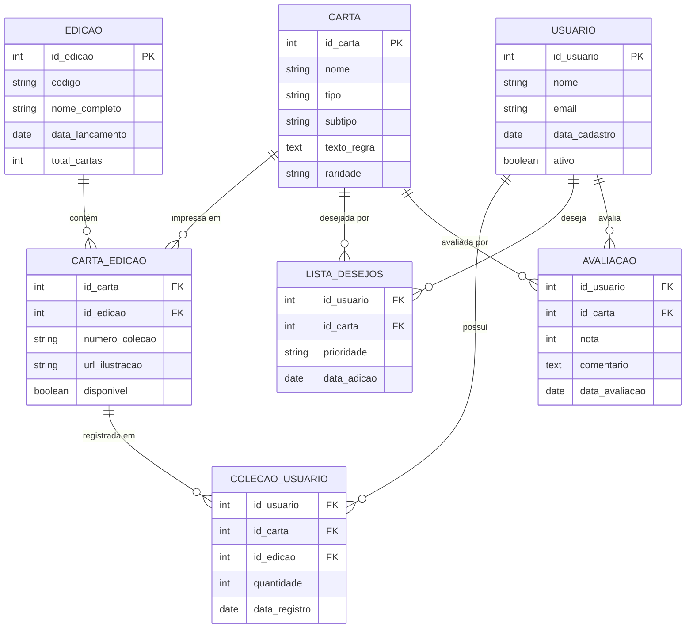
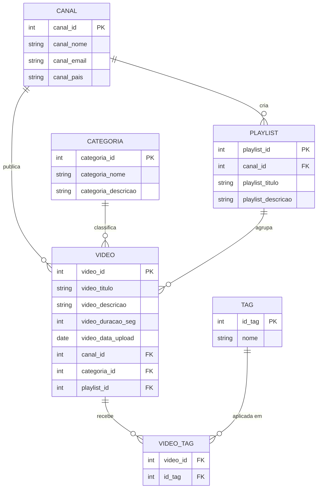

# Gabarito — Prova Presencial BD1 (SENAC)
**Uso restrito: professor**  
**Data:** 17/09/2025

> Este gabarito apresenta uma solução de referência. Variações válidas de modelagem devem ser consideradas desde que demonstrem raciocínio correto, cobertura do cenário e justificativas consistentes.

---

## Exercício 1 — Modelagem Relacional: Catálogo de Cards (5,0 pts)

---

### 1. Tabelas, Atributos e Restrições

---

#### CARTA
Representa uma carta única do jogo, independente de em qual edição foi impressa.

| Campo | Tipo | Restrições | Observação |
|---|---|---|---|
| `id_carta` | INTEGER | PK, NOT NULL | Surrogate key |
| `nome` | VARCHAR(150) | NOT NULL | Nome oficial da carta |
| `tipo` | VARCHAR(50) | NOT NULL, CHECK IN ('criatura','feitiço','encantamento','artefato','terreno','planeswalker','instantâneo') | Tipo principal |
| `subtipo` | VARCHAR(100) | NULL | Ex.: "Elfo Guerreiro" |
| `texto_regra` | TEXT | NULL | Pode ser vazio (ex.: terrenos básicos) |
| `raridade` | VARCHAR(20) | NOT NULL, CHECK IN ('comum','incomum','rara','mítica') | Domínio fixo |

**Superchave não-mínima:** `{id_carta, nome}` — contém atributo redundante.

**Chaves candidatas:**
- `{id_carta}` — surrogate key, gerada automaticamente, identifica univocamente. **→ PK escolhida.**
- `{nome}` — *candidata em tese*, mas cartas de jogos TCG reais podem ter homônimas em contextos distintos; recomenda-se tratar como não-candidata ou aceitar UNIQUE com ressalva.

---

#### EDICAO
Representa uma coleção/expansão do jogo em que cartas são impressas.

| Campo | Tipo | Restrições | Observação |
|---|---|---|---|
| `id_edicao` | INTEGER | PK, NOT NULL | Surrogate key |
| `codigo` | VARCHAR(10) | NOT NULL, UNIQUE | Ex.: "DMU", "MOM" |
| `nome_completo` | VARCHAR(150) | NOT NULL | Ex.: "Dominaria United" |
| `data_lancamento` | DATE | NOT NULL | — |
| `total_cartas` | INTEGER | NOT NULL, CHECK > 0 | Quantidade de cartas na edição |

**Superchave não-mínima:** `{id_edicao, codigo, nome_completo}`.

**Chaves candidatas:**
- `{id_edicao}` — **→ PK escolhida.**
- `{codigo}` — único por regra de negócio; chave alternada. Implementar com `UNIQUE NOT NULL`.

---

#### CARTA_EDICAO
Tabela associativa N:M entre CARTA e EDICAO. Representa a impressão de uma carta em uma edição específica. Carrega atributos próprios do relacionamento.

| Campo | Tipo | Restrições | Observação |
|---|---|---|---|
| `id_carta` | INTEGER | FK → CARTA, NOT NULL | — |
| `id_edicao` | INTEGER | FK → EDICAO, NOT NULL | — |
| `numero_colecao` | VARCHAR(10) | NOT NULL | Ex.: "042/272"; pode variar por edição |
| `url_ilustracao` | VARCHAR(300) | NULL | Ilustração pode variar por edição |
| `disponivel` | BOOLEAN | NOT NULL, DEFAULT TRUE | Controle de disponibilidade |

**PK composta:** `(id_carta, id_edicao)` — uma carta aparece no máximo uma vez por edição.

**Justificativa da PK:** `id_carta` sozinho não identifica a linha (a mesma carta existe em várias edições); `id_edicao` sozinho também não (uma edição tem centenas de cartas); apenas o **par** identifica unicamente a impressão.

**Superchave não-mínima:** `{id_carta, id_edicao, numero_colecao}`.

**Chave candidata alternativa:** `{id_edicao, numero_colecao}` — o número de coleção é único dentro de uma edição, portanto esse par também identifica unicamente a carta impressa.

---

#### USUARIO
Representa os usuários cadastrados na plataforma.

| Campo | Tipo | Restrições | Observação |
|---|---|---|---|
| `id_usuario` | INTEGER | PK, NOT NULL | Surrogate key |
| `nome` | VARCHAR(100) | NOT NULL | — |
| `email` | VARCHAR(150) | NOT NULL, UNIQUE | Identificador natural |
| `data_cadastro` | DATE | NOT NULL, DEFAULT CURRENT_DATE | — |
| `ativo` | BOOLEAN | NOT NULL, DEFAULT TRUE | Controle de conta |

**Superchave não-mínima:** `{id_usuario, email}`.

**Chaves candidatas:**
- `{id_usuario}` — **→ PK escolhida.**
- `{email}` — único por regra de negócio; chave alternada. Implementar com `UNIQUE NOT NULL`.

---

#### COLECAO_USUARIO
Tabela associativa que registra quantas cópias de uma carta (em uma edição específica) um usuário possui. O objeto de posse é a impressão (CARTA_EDICAO), não a carta abstrata.

| Campo | Tipo | Restrições | Observação |
|---|---|---|---|
| `id_usuario` | INTEGER | FK → USUARIO, NOT NULL | — |
| `id_carta` | INTEGER | FK → CARTA_EDICAO(id_carta), NOT NULL | — |
| `id_edicao` | INTEGER | FK → CARTA_EDICAO(id_edicao), NOT NULL | — |
| `quantidade` | INTEGER | NOT NULL, CHECK >= 1 | Mínimo 1 cópia para estar na coleção |
| `data_registro` | DATE | NOT NULL, DEFAULT CURRENT_DATE | — |

**PK composta:** `(id_usuario, id_carta, id_edicao)` — um usuário registra suas cópias de uma impressão específica uma única vez (atualiza `quantidade` se ganhar mais).

**Justificativa da PK:** o trio (usuário + carta + edição) identifica univocamente o registro de posse. Nenhum subconjunto sozinho é suficiente.

**FK composta:** `(id_carta, id_edicao)` referencia `CARTA_EDICAO(id_carta, id_edicao)`.

---

#### LISTA_DESEJOS
Registra cartas que um usuário deseja adquirir, com prioridade.

| Campo | Tipo | Restrições | Observação |
|---|---|---|---|
| `id_usuario` | INTEGER | FK → USUARIO, NOT NULL | — |
| `id_carta` | INTEGER | FK → CARTA, NOT NULL | Desejo pela carta, sem restrição de edição |
| `prioridade` | VARCHAR(10) | NOT NULL, CHECK IN ('alta','media','baixa') | — |
| `data_adicao` | DATE | NOT NULL, DEFAULT CURRENT_DATE | — |

**PK composta:** `(id_usuario, id_carta)` — um usuário adiciona cada carta à lista no máximo uma vez.

**Superchave não-mínima:** `{id_usuario, id_carta, data_adicao}`.

---

#### AVALIACAO
Registra a nota e comentário de um usuário sobre uma carta. Cada usuário avalia cada carta no máximo uma vez.

| Campo | Tipo | Restrições | Observação |
|---|---|---|---|
| `id_usuario` | INTEGER | FK → USUARIO, NOT NULL | — |
| `id_carta` | INTEGER | FK → CARTA, NOT NULL | Avaliação da carta, não de uma impressão |
| `nota` | INTEGER | NOT NULL, CHECK BETWEEN 1 AND 5 | Escala 1–5 |
| `comentario` | TEXT | NULL | Comentário opcional |
| `data_avaliacao` | DATE | NOT NULL, DEFAULT CURRENT_DATE | — |

**PK composta:** `(id_usuario, id_carta)` — a regra "cada usuário avalia cada carta no máximo uma vez" é imposta pela PK.

**Justificativa da PK:** inserir a mesma combinação (usuário, carta) duas vezes gera violação de chave — o banco impede a duplicata automaticamente.

---

### 2. Relacionamentos e Cardinalidades

| Relacionamento | Tipo | Tabela/FK | Observação |
|---|---|---|---|
| CARTA → CARTA_EDICAO | 1:N (carta tem N impressões) | `CARTA_EDICAO.id_carta` | Uma carta pode estar em várias edições |
| EDICAO → CARTA_EDICAO | 1:N (edição tem N cartas) | `CARTA_EDICAO.id_edicao` | Uma edição contém várias cartas |
| USUARIO → COLECAO_USUARIO | 1:N | `COLECAO_USUARIO.id_usuario` | Um usuário tem muitos itens na coleção |
| CARTA_EDICAO → COLECAO_USUARIO | 1:N | `(id_carta,id_edicao)` | Uma impressão pode estar na coleção de muitos usuários |
| USUARIO ↔ CARTA (via LISTA_DESEJOS) | N:M | tabela associativa | Usuário deseja muitas cartas; carta é desejada por muitos |
| USUARIO ↔ CARTA (via AVALIACAO) | N:M | tabela associativa | Usuário avalia muitas cartas; carta é avaliada por muitos |

---

### 3. Modelo Relacional Textual

```
CARTA(id_carta PK, nome, tipo, subtipo, texto_regra, raridade)

EDICAO(id_edicao PK, codigo UNIQUE, nome_completo, data_lancamento, total_cartas)

CARTA_EDICAO(id_carta FK→CARTA, id_edicao FK→EDICAO,
             numero_colecao, url_ilustracao, disponivel
             PK: (id_carta, id_edicao))

USUARIO(id_usuario PK, nome, email UNIQUE, data_cadastro, ativo)

COLECAO_USUARIO(id_usuario FK→USUARIO, id_carta FK, id_edicao FK,
                quantidade CHECK>=1, data_registro
                PK: (id_usuario, id_carta, id_edicao)
                FK composta: (id_carta,id_edicao)→CARTA_EDICAO)

LISTA_DESEJOS(id_usuario FK→USUARIO, id_carta FK→CARTA,
              prioridade CHECK IN('alta','media','baixa'), data_adicao
              PK: (id_usuario, id_carta))

AVALIACAO(id_usuario FK→USUARIO, id_carta FK→CARTA,
          nota CHECK BETWEEN 1 AND 5, comentario, data_avaliacao
          PK: (id_usuario, id_carta))
```

---

### 4. Critérios de Correção — Exercício 1

#### (1,5 pt) Cobertura e atributos

| Situação | Pontuação |
|---|---|
| ≥ 5 tabelas com ≥ 5 campos cada, cobrindo carta, edição, usuário, coleção e ao menos uma tabela de interação | 1,5 |
| 4 tabelas ou campos faltantes em alguma | 1,0 |
| Menos de 4 tabelas ou cobertura superficial do cenário | 0,5 |

Penalizar se: CARTA e CARTA_EDICAO foram colapsadas (perde a separação carta abstrata × impressão); coleção não registra edição; quantidade ausente em COLECAO_USUARIO.

#### (1,5 pt) Relacionamentos e cardinalidades

| Situação | Pontuação |
|---|---|
| Todos os relacionamentos identificados com cardinalidade correta e FKs adequadas | 1,5 |
| Maioria correta, 1–2 cardinalidades erradas ou FK faltando | 1,0 |
| Relacionamentos presentes mas sem cardinalidade ou com erros substanciais | 0,5 |

Penalizar se: CARTA_EDICAO modelada como 1:N direto sem tabela associativa; LISTA_DESEJOS ou AVALIACAO modeladas com FK simples sem tabela própria para o N:M.

#### (1,5 pt) Chaves

| Situação | Pontuação |
|---|---|
| PK de todas as tabelas corretas; PKs compostas com justificativa; ao menos uma superchave não-mínima e uma chave candidata alternativa identificadas; FKs corretas | 1,5 |
| PKs corretas mas sem justificativa das compostas; superchaves/candidatas parcialmente identificadas | 1,0 |
| PKs corretas mas sem identificação de candidatas/superchaves | 0,5 |

#### (0,5 pt) Clareza e organização

| Situação | Pontuação |
|---|---|
| Modelo legível, campos tipados, restrições indicadas | 0,5 |
| Modelo parcialmente organizado | 0,25 |
| Difícil de ler ou sem restrições | 0,0 |

---

---

### 5. Diagrama Mermaid — Modelo Relacional (Exercício 1)



---

## Exercício 2 — Normalização: Sistema de Vídeos (5,0 pts)

---

### Tarefa 1 — Anomalias e Dependências Funcionais (1,0 pt)

#### Dependências Funcionais do esquema inicial

A partir da semântica do sistema, as DFs relevantes são:

```
video_id → video_titulo, video_descricao, video_duracao_seg,
           video_data_upload, canal_id, categoria_id,
           playlist_id, source_url,
           visualizacoes_total, likes_total

canal_id → canal_nome, canal_email, canal_pais

categoria_id → categoria_nome, categoria_descricao

playlist_id → playlist_titulo, playlist_descricao
```

A coluna `tags_csv` **não tem DF bem definida** — é um valor multivalorado armazenado
de forma inadequada.

#### Anomalias de Inserção

> **Problema:** não é possível cadastrar uma entidade sem ter outra associada.

- Um **canal** novo que ainda não publicou nenhum vídeo não pode ser inserido — não existe linha sem `video_id`.
- Uma **categoria** nova (ex.: "Shorts") não pode ser cadastrada antes de haver um vídeo nela.
- Uma **playlist** vazia não pode ser registrada no banco.

#### Anomalias de Atualização

> **Problema:** um fato do mundo real está repetido em N linhas; atualizar parcialmente gera inconsistência.

- O canal "TechBurner" (canal_id = 7) publica 300 vídeos. Se o e-mail do canal mudar, **300 linhas** precisam ser atualizadas. Se apenas parte delas for atualizada, o banco fica com dois e-mails diferentes para o mesmo canal.
- A categoria "Tecnologia" (categoria_id = 3) tem `categoria_descricao` repetida em todos os vídeos dessa categoria. Atualizar a descrição exige atualizar todas essas linhas.

#### Anomalias de Remoção

> **Problema:** deletar um registro apaga inadvertidamente dados de outra entidade.

- Se o único vídeo de um canal for deletado, os dados do **canal** (nome, e-mail, país) são perdidos.
- Se o único vídeo de uma categoria for deletado, os dados da **categoria** somem.
- Se o único vídeo de uma playlist for deletado, a **playlist** deixa de existir no banco.

#### Atributos Derivados Armazenados

- `visualizacoes_total` e `likes_total` são **contagens derivadas** — deveriam ser calculadas por query/view a partir das tabelas de visualizações e likes, não armazenadas diretamente. Armazená-las cria risco de inconsistência entre o contador e os registros reais.

---

### Tarefa 2 — Normalização até 3FN com Justificativas (2,0 pt)

---

#### Etapa 1 — Aplicação da 1FN: eliminar multivalorados

**Problema identificado:** a coluna `tags_csv` armazena múltiplas tags como string
concatenada (`"tecnologia;review;smartphone"`). Isso viola a **Primeira Forma Normal**,
que exige que todo atributo seja atômico — um único valor por célula.

**Consequência prática:** não é possível buscar todos os vídeos com a tag `"review"`
de forma confiável com igualdade; é necessário usar `LIKE '%review%'`, que pode
retornar falsos positivos.

**Solução:** criar uma tabela separada `TAG` e uma tabela associativa `VIDEO_TAG`
para representar a relação N:M entre vídeos e tags.

```
TAG(id_tag PK, nome UNIQUE NOT NULL)

VIDEO_TAG(
  video_id FK → VIDEO,
  id_tag   FK → TAG,
  PK: (video_id, id_tag)
)
```

Após esta etapa, `tags_csv` é removida da tabela principal.

---

#### Etapa 2 — Aplicação da 2FN: eliminar dependências parciais

A 2FN se aplica quando a chave primária é composta. Neste esquema, a PK é
`video_id` (simples), então tecnicamente a 2FN não é violada pela definição clássica.

Porém, o espírito da 2FN — **cada atributo deve depender da chave, e não de
outro atributo não-chave** — é violado porque atributos de canal, categoria e
playlist dependem de `canal_id`, `categoria_id` e `playlist_id` respectivamente,
e **não** de `video_id`. Estas são dependências de **sub-entidades inteiras** que
precisam ser separadas.

**Solução:** extrair cada entidade para sua própria tabela, mantendo apenas a FK
na tabela de vídeos.

```
CANAL(
  canal_id   PK,
  canal_nome NOT NULL,
  canal_email UNIQUE NOT NULL,
  canal_pais NOT NULL
)

CATEGORIA(
  categoria_id   PK,
  categoria_nome NOT NULL UNIQUE,
  categoria_descricao TEXT
)

PLAYLIST(
  playlist_id    PK,
  canal_id       FK → CANAL NOT NULL,
  playlist_titulo NOT NULL,
  playlist_descricao TEXT
)

VIDEO(
  video_id          PK,
  video_titulo      NOT NULL,
  video_descricao   TEXT,
  video_duracao_seg INTEGER NOT NULL CHECK > 0,
  video_data_upload DATE NOT NULL,
  canal_id          FK → CANAL NOT NULL,
  categoria_id      FK → CATEGORIA NOT NULL,
  playlist_id       FK → PLAYLIST NULL   ← vídeo pode não ter playlist
)
```

Os atributos derivados `visualizacoes_total` e `likes_total` são **removidos**
da tabela VIDEO — eles devem ser calculados via query quando necessário.

---

#### Etapa 3 — Aplicação da 3FN: eliminar dependências transitivas

Após a etapa anterior, inspecionamos se ainda existe alguma dependência transitiva
dentro das tabelas resultantes — isto é, se algum atributo não-chave determina
outro atributo não-chave.

Analisando cada tabela:

- **CANAL:** `canal_id → canal_nome, canal_email, canal_pais` — todos dependem diretamente da PK. ✅
- **CATEGORIA:** `categoria_id → categoria_nome, categoria_descricao` — direto. ✅
- **PLAYLIST:** `playlist_id → canal_id, playlist_titulo, playlist_descricao` — direto. ✅
- **VIDEO:** todas as colunas dependem de `video_id` diretamente. ✅

**Neste esquema, após a etapa 2, não há dependências transitivas remanescentes.**
O esquema já satisfaz a 3FN.

> **Observação para o professor:** aceitar como resposta válida um aluno que identifique
> que, *hipoteticamente*, se `canal_pais → fuso_horario` fosse uma regra de negócio,
> isso configuraria uma dependência transitiva — e que a solução seria criar uma tabela
> PAIS separada. A demonstração do raciocínio correto deve ser valorizada.

---

### Tarefa 3 — Esquema Final com PKs, FKs, UNIQUE e CHECK (1,0 pt)

```
CANAL(
  canal_id    INTEGER     PK,
  canal_nome  VARCHAR(100) NOT NULL,
  canal_email VARCHAR(150) NOT NULL UNIQUE,
  canal_pais  CHAR(2)      NOT NULL         -- código ISO 3166-1 alpha-2
)

CATEGORIA(
  categoria_id   INTEGER      PK,
  categoria_nome VARCHAR(80)  NOT NULL UNIQUE,
  categoria_descricao TEXT
)

PLAYLIST(
  playlist_id        INTEGER      PK,
  canal_id           INTEGER      NOT NULL FK → CANAL,
  playlist_titulo    VARCHAR(150) NOT NULL,
  playlist_descricao TEXT
)

VIDEO(
  video_id          INTEGER      PK,
  video_titulo      VARCHAR(200) NOT NULL,
  video_descricao   TEXT,
  video_duracao_seg INTEGER      NOT NULL CHECK (video_duracao_seg > 0),
  video_data_upload DATE         NOT NULL,
  canal_id          INTEGER      NOT NULL FK → CANAL,
  categoria_id      INTEGER      NOT NULL FK → CATEGORIA,
  playlist_id       INTEGER      NULL     FK → PLAYLIST
)

TAG(
  id_tag  INTEGER     PK,
  nome    VARCHAR(50) NOT NULL UNIQUE
)

VIDEO_TAG(
  video_id INTEGER NOT NULL FK → VIDEO,
  id_tag   INTEGER NOT NULL FK → TAG,
  PK: (video_id, id_tag)
)
```

---

### Tarefa 4 — Diagrama Mermaid do esquema normalizado (1,0 pt)



---

### Tarefa 5 — Como a decomposição elimina as anomalias (incluída na 1,0 pt da Tarefa 3)

| Anomalia original | Como foi eliminada |
|---|---|
| **Inserção de canal sem vídeo** | CANAL é tabela independente — um canal pode ser inserido sem nenhum vídeo associado |
| **Inserção de categoria/playlist sem vídeo** | CATEGORIA e PLAYLIST são tabelas próprias — existem independentemente |
| **Atualização do e-mail do canal em N linhas** | `canal_email` existe em exatamente **1 linha** em CANAL — 1 UPDATE resolve |
| **Atualização da descrição da categoria em N linhas** | `categoria_descricao` existe em **1 linha** em CATEGORIA |
| **Remoção de vídeo apaga dados do canal** | CANAL persiste independentemente; deletar VIDEO não afeta CANAL |
| **Tags não pesquisáveis** | VIDEO_TAG + TAG permitem `JOIN` limpo; busca por tag com igualdade simples |
| **Contadores derivados inconsistentes** | `visualizacoes_total` e `likes_total` removidos — calculados por query quando necessário |

---

### Critérios de Correção — Exercício 2

#### (1,0 pt) Identificação das anomalias

| Situação | Pontuação |
|---|---|
| Identifica os 3 tipos (inserção, remoção, atualização) com exemplos concretos do sistema, e menciona o problema dos derivados | 1,0 |
| Identifica 2 tipos com exemplos concretos | 0,7 |
| Identifica anomalias de forma genérica, sem exemplos concretos | 0,3 |

#### (2,0 pts) Normalização com justificativa

| Situação | Pontuação |
|---|---|
| 1FN aplicada corretamente (tags extraídas para tabela própria com justificativa); 2FN aplicada com separação de canal, categoria e playlist com justificativa; 3FN verificada com justificativa (mesmo que conclua que não havia violação remanescente) | 2,0 |
| 2 das 3 etapas corretas com justificativa | 1,3 |
| Esquema final correto mas sem justificativa das etapas | 0,8 |
| Apenas 1FN aplicada corretamente | 0,5 |

**Atenção:** a justificativa é parte obrigatória da pontuação desta tarefa. Um esquema
final perfeito sem nenhuma explicação das etapas **não** recebe a pontuação total.

#### (1,0 pt) Esquema final com PKs, FKs, UNIQUE e CHECK

| Situação | Pontuação |
|---|---|
| Todas as tabelas com PK correta, FKs corretas, UNIQUE em email e nome de categoria, CHECK em duracao_seg | 1,0 |
| Maioria correta, 1–2 restrições faltando | 0,7 |
| PKs corretas mas sem FKs ou restrições | 0,4 |

#### (1,0 pt) Diagrama Mermaid

| Situação | Pontuação |
|---|---|
| Diagrama correto, com todas as entidades, relacionamentos e cardinalidades coerentes com o esquema normalizado | 1,0 |
| Diagrama presente mas com 1–2 entidades faltando ou cardinalidades erradas | 0,7 |
| Diagrama presente mas com erros substanciais ou entidades faltando | 0,3 |
| Sem diagrama | 0,0 |

---

## BÔNUS — Modelo Entidade-Relacionamento (2,0 pts)

### Critério geral

O bônus avalia a capacidade de representar o modelo conceitual, camada anterior
ao modelo relacional. Aceitar qualquer notação ER desde que consistente (Chen,
Crow's Foot, UML simplificado).

### Exercício 1 — DER esperado (TCG)

Entidades e elementos esperados:

| Elemento | Tipo | Observação |
|---|---|---|
| CARTA | Entidade | Atributo-chave: `id_carta`; multivalorado: nenhum; derivado: nenhum |
| EDICAO | Entidade | Atributo-chave: `id_edicao` |
| USUARIO | Entidade | Atributo-chave: `id_usuario` |
| IMPRESSAO (CARTA_EDICAO) | Entidade associativa ou relação N:M | Atributos próprios: `numero_colecao`, `url_ilustracao` |
| POSSUI (COLECAO_USUARIO) | Entidade associativa ternária | Conecta USUARIO + CARTA + EDICAO; atributo: `quantidade` |
| DESEJA (LISTA_DESEJOS) | Relação N:M | Atributo: `prioridade` |
| AVALIA (AVALIACAO) | Relação N:M | Atributos: `nota`, `comentario` |

Participações esperadas:

- CARTA — **impressa em** — EDICAO: parcial dos dois lados (nem toda carta está em toda edição)
- USUARIO — **possui** — CARTA_EDICAO: parcial dos dois lados
- USUARIO — **avalia** — CARTA: parcial dos dois lados

### Exercício 2 — DER esperado (YouTube normalizado)

| Elemento | Tipo | Observação |
|---|---|---|
| CANAL | Entidade forte | |
| VIDEO | Entidade | Participação total em CANAL (todo vídeo tem canal) |
| CATEGORIA | Entidade | |
| PLAYLIST | Entidade | Participação total em CANAL |
| TAG | Entidade | |
| `visualizacoes_total` | Atributo derivado | Deve ser marcado como derivado no DER |
| `tags_csv` | Atributo multivalorado no esquema inicial | Deve ser representado com duplo oval no DER inicial |

### Pontuação do Bônus

| Situação | Pontuação |
|---|---|
| DER de ambos os exercícios com entidades, relacionamentos, cardinalidades, participações, atributos especiais (derivados, multivalorados) | 2,0 |
| DER de ambos corretos mas sem atributos especiais ou participações | 1,3 |
| DER de apenas um exercício completo | 1,0 |
| DER presente mas com erros substanciais em ambos | 0,5 |

---

## Tabela de Pontuação Final

| Exercício | Critério | Pontos possíveis |
|---|---|---|
| Ex. 1 | Cobertura de tabelas e atributos | 1,5 |
| Ex. 1 | Relacionamentos e cardinalidades | 1,5 |
| Ex. 1 | Chaves com justificativa | 1,5 |
| Ex. 1 | Clareza e organização | 0,5 |
| Ex. 2 | Anomalias com exemplos concretos | 1,0 |
| Ex. 2 | Normalização com justificativa por etapa | 2,0 |
| Ex. 2 | Esquema final (PKs, FKs, UNIQUE, CHECK) | 1,0 |
| Ex. 2 | Diagrama Mermaid normalizado | 1,0 |
| **Total** | | **10,0** |
| Bônus | DER dos dois exercícios | 2,0 |
