# Modelo Relacional — Plataforma de Streaming Musical (Spotify)
> Derivado do DER · Notação: **Tabela**(atributo, **_chave_estrangeira_**, <u>chave_primária</u>)
> 
> 🔑 Sublinhado = Chave Primária (PK) · *Itálico* = Chave Estrangeira (FK) · `*` = Atributo Derivado (não armazenado)

---

## Regras de Mapeamento Aplicadas

| Situação no DER | Resultado no Modelo Relacional |
|---|---|
| Entidade comum | Uma tabela com seus atributos |
| Entidade fraca | Tabela com PK composta (PK própria + FK do forte) |
| Atributo multivalorado `{ }` | Nova tabela com FK para a entidade |
| Atributo derivado `*` | **Não vira coluna** — calculado por query/view |
| Relacionamento 1:N | FK na tabela do lado N |
| Relacionamento N:M | Nova tabela associativa com os atributos do relacionamento |
| Relacionamento recursivo N:M | Tabela associativa com dois FKs para a mesma tabela |

---

## Tabelas

### 1. USUARIO
```
USUARIO (
    id_usuario      INTEGER         PK,
    nome            VARCHAR(100)    NOT NULL,
    email           VARCHAR(150)    NOT NULL UNIQUE,
    data_nascimento DATE,
    pais            CHAR(5),
    plano           VARCHAR(20)     NOT NULL DEFAULT 'gratuito'
                                    CHECK (plano IN ('gratuito','premium'))
    -- engajamento_mensal: DERIVADO → calculado via VIEW ou query
)
```

---

### 2. ARTISTA
```
ARTISTA (
    id_artista      INTEGER         PK,
    nome_artistico  VARCHAR(150)    NOT NULL,
    pais_origem     CHAR(5),
    biografia       TEXT,
    tipo            VARCHAR(10)     NOT NULL DEFAULT 'solo'
                                    CHECK (tipo IN ('solo','banda'))
    -- ouvintes_mensais: DERIVADO → COUNT DISTINCT em REPRODUCAO por mês
)
```

---

### 3. REDES_SOCIAIS  ← multivalorado de ARTISTA
```
REDES_SOCIAIS (
    id_rede         INTEGER         PK,
    id_artista      INTEGER         FK → ARTISTA(id_artista),
    plataforma      VARCHAR(50)     NOT NULL,
    url             VARCHAR(300)    NOT NULL
)
```

---

### 4. MUSICA
```
MUSICA (
    id_musica       INTEGER         PK,
    titulo          VARCHAR(200)    NOT NULL,
    duracao_seg     INTEGER         NOT NULL,
    letra           TEXT            NULL
    -- duracao_media: DERIVADO → AVG(segundos_ouvidos) em REPRODUCAO
)
```

---

### 5. GENERO_MUSICA  ← multivalorado de MUSICA
```
GENERO_MUSICA (
    id_genero       INTEGER         PK,
    id_musica       INTEGER         FK → MUSICA(id_musica),
    nome            VARCHAR(80)     NOT NULL
)
```

---

### 6. ALBUM
```
ALBUM (
    id_album        INTEGER         PK,
    titulo          VARCHAR(200)    NOT NULL,
    data_lancamento DATE,
    capa_url        VARCHAR(300),
    tipo            VARCHAR(20)     CHECK (tipo IN ('single','EP','album'))
    -- total_faixas: DERIVADO → COUNT em MUSICA_ALBUM
)
```

---

### 7. PLAYLIST
```
PLAYLIST (
    id_playlist         INTEGER         PK,
    id_usuario_criador  INTEGER         FK → USUARIO(id_usuario) NOT NULL,
    nome                VARCHAR(150)    NOT NULL,
    descricao           TEXT,
    publica             BOOLEAN         NOT NULL DEFAULT TRUE,
    colaborativa        BOOLEAN         NOT NULL DEFAULT FALSE,
    data_criacao        TIMESTAMP       NOT NULL DEFAULT NOW()
)
```
> A FK `id_usuario_criador` mapeia o relacionamento **1:N** de *cria* (USUARIO → PLAYLIST).

---

### 8. ASSINATURA
```
ASSINATURA (
    id_assinatura   INTEGER         PK,
    id_usuario      INTEGER         FK → USUARIO(id_usuario) NOT NULL,
    tipo_plano      VARCHAR(20)     NOT NULL,
    data_inicio     DATE            NOT NULL,
    data_fim        DATE            NULL,   -- NULL = assinatura ativa
    valor_pago      DECIMAL(10,2)
)
```
> A FK `id_usuario` mapeia o relacionamento **1:N** de *possui* (USUARIO → ASSINATURA).

---

### 9. REPRODUCAO  ← entidade fraca
```
REPRODUCAO (
    id_reproducao       INTEGER         PK,
    id_usuario          INTEGER         FK → USUARIO(id_usuario)  NOT NULL,
    id_musica           INTEGER         FK → MUSICA(id_musica)    NOT NULL,
    data_hora           TIMESTAMP       NOT NULL,
    segundos_ouvidos    INTEGER         NOT NULL,
    dispositivo         VARCHAR(30)     CHECK (dispositivo IN ('celular','desktop','smart_tv','web','outro'))
    -- ouviu_completo: DERIVADO → segundos_ouvidos >= MUSICA.duracao_seg
)
```
> Entidade fraca: depende de USUARIO e MUSICA. As FKs mapeiam os relacionamentos **gera** (1:N) e **de** (N:1).

---

## Tabelas Associativas (N:M)

### 10. USUARIO_CURTE_MUSICA
```
USUARIO_CURTE_MUSICA (
    id_usuario      INTEGER     FK → USUARIO(id_usuario),
    id_musica       INTEGER     FK → MUSICA(id_musica),
    data_curtida    TIMESTAMP   NOT NULL DEFAULT NOW(),

    PRIMARY KEY (id_usuario, id_musica)
)
```

---

### 11. USUARIO_SEGUE_ARTISTA
```
USUARIO_SEGUE_ARTISTA (
    id_usuario      INTEGER     FK → USUARIO(id_usuario),
    id_artista      INTEGER     FK → ARTISTA(id_artista),
    data_inicio     TIMESTAMP   NOT NULL DEFAULT NOW(),

    PRIMARY KEY (id_usuario, id_artista)
)
```

---

### 12. USUARIO_SEGUE_USUARIO  ← recursivo
```
USUARIO_SEGUE_USUARIO (
    id_seguidor     INTEGER     FK → USUARIO(id_usuario),
    id_seguido      INTEGER     FK → USUARIO(id_usuario),
    data_inicio     TIMESTAMP   NOT NULL DEFAULT NOW(),

    PRIMARY KEY (id_seguidor, id_seguido),
    CHECK (id_seguidor <> id_seguido)   -- usuário não pode seguir a si mesmo
)
```
> Auto-relacionamento N:M: dois FKs apontam para a **mesma tabela** USUARIO com papéis distintos.

---

### 13. USUARIO_COLABORA_PLAYLIST
```
USUARIO_COLABORA_PLAYLIST (
    id_usuario      INTEGER     FK → USUARIO(id_usuario),
    id_playlist     INTEGER     FK → PLAYLIST(id_playlist),
    data_entrada    TIMESTAMP   NOT NULL DEFAULT NOW(),

    PRIMARY KEY (id_usuario, id_playlist)
)
```
> Relacionamento distinto de *cria*: representa colaboradores adicionais em playlists colaborativas.

---

### 14. PLAYLIST_MUSICA
```
PLAYLIST_MUSICA (
    id_playlist     INTEGER     FK → PLAYLIST(id_playlist),
    id_musica       INTEGER     FK → MUSICA(id_musica),
    ordem           INTEGER     NOT NULL,
    data_adicao     TIMESTAMP   NOT NULL DEFAULT NOW(),

    PRIMARY KEY (id_playlist, id_musica)
)
```
> `ordem` é atributo **do relacionamento** — não pertence à MUSICA nem à PLAYLIST isoladas.

---

### 15. MUSICA_ALBUM
```
MUSICA_ALBUM (
    id_musica       INTEGER     FK → MUSICA(id_musica),
    id_album        INTEGER     FK → ALBUM(id_album),
    faixa_numero    INTEGER     NOT NULL,

    PRIMARY KEY (id_musica, id_album)
)
```
> Uma música pode aparecer em mais de um álbum (ex.: single + álbum deluxe).

---

### 16. ALBUM_ARTISTA
```
ALBUM_ARTISTA (
    id_album        INTEGER         FK → ALBUM(id_album),
    id_artista      INTEGER         FK → ARTISTA(id_artista),
    papel           VARCHAR(30)     NOT NULL DEFAULT 'principal'
                                    CHECK (papel IN ('principal','featuring')),

    PRIMARY KEY (id_album, id_artista)
)
```

---

### 17. MUSICA_ARTISTA
```
MUSICA_ARTISTA (
    id_musica       INTEGER         FK → MUSICA(id_musica),
    id_artista      INTEGER         FK → ARTISTA(id_artista),
    papel           VARCHAR(30)     NOT NULL DEFAULT 'principal'
                                    CHECK (papel IN ('principal','featuring')),

    PRIMARY KEY (id_musica, id_artista)
)
```

---

### 18. ARTISTA_MEMBRO  ← recursivo
```
ARTISTA_MEMBRO (
    id_banda        INTEGER     FK → ARTISTA(id_artista),
    id_membro       INTEGER     FK → ARTISTA(id_artista),
    data_entrada    DATE        NOT NULL,
    data_saida      DATE        NULL,   -- NULL = membro atual

    PRIMARY KEY (id_banda, id_membro),
    CHECK (id_banda <> id_membro)
)
```
> Auto-relacionamento N:M: modela bandas e seus membros sem criar tabela separada para BANDA.

---

## Resumo — Contagem de Tabelas

| Origem | Tabelas geradas | Nomes |
|---|---|---|
| Entidades simples | 6 | USUARIO, ARTISTA, MUSICA, ALBUM, PLAYLIST, ASSINATURA |
| Entidade fraca | 1 | REPRODUCAO |
| Atributos multivalorados | 2 | REDES_SOCIAIS, GENERO_MUSICA |
| Relacionamentos N:M | 8 | USUARIO_CURTE_MUSICA, USUARIO_SEGUE_ARTISTA, USUARIO_SEGUE_USUARIO, USUARIO_COLABORA_PLAYLIST, PLAYLIST_MUSICA, MUSICA_ALBUM, ALBUM_ARTISTA, MUSICA_ARTISTA |
| Recursivos | 1 | ARTISTA_MEMBRO |
| **Total** | **18** | |

> Relacionamentos 1:N não geram tabela — viram FK na tabela do lado N.
> Atributos derivados não geram coluna — são calculados por VIEWs ou queries sob demanda.

---

## Diagrama Mermaid — Modelo Relacional Completo

```mermaid
erDiagram

    %% ── ENTIDADES PRINCIPAIS ──────────────────────────────────────────────

    USUARIO {
        int         id_usuario          PK
        varchar     nome
        varchar     email               "UNIQUE"
        date        data_nascimento
        char        pais
        varchar     plano               "gratuito | premium"
    }

    ARTISTA {
        int         id_artista          PK
        varchar     nome_artistico
        char        pais_origem
        text        biografia
        varchar     tipo                "solo | banda"
    }

    MUSICA {
        int         id_musica           PK
        varchar     titulo
        int         duracao_seg
        text        letra               "nullable"
    }

    ALBUM {
        int         id_album            PK
        varchar     titulo
        date        data_lancamento
        varchar     capa_url
        varchar     tipo                "single | EP | album"
    }

    PLAYLIST {
        int         id_playlist             PK
        int         id_usuario_criador      FK
        varchar     nome
        text        descricao
        boolean     publica
        boolean     colaborativa
        timestamp   data_criacao
    }

    ASSINATURA {
        int         id_assinatura       PK
        int         id_usuario          FK
        varchar     tipo_plano
        date        data_inicio
        date        data_fim            "nullable: null = ativa"
        decimal     valor_pago
    }

    %% ── ENTIDADE FRACA ────────────────────────────────────────────────────

    REPRODUCAO {
        int         id_reproducao       PK
        int         id_usuario          FK
        int         id_musica           FK
        timestamp   data_hora
        int         segundos_ouvidos
        varchar     dispositivo         "celular|desktop|smart_tv|web"
    }

    %% ── MULTIVALORADOS (viraram tabelas) ──────────────────────────────────

    REDES_SOCIAIS {
        int         id_rede             PK
        int         id_artista          FK
        varchar     plataforma
        varchar     url
    }

    GENERO_MUSICA {
        int         id_genero           PK
        int         id_musica           FK
        varchar     nome
    }

    %% ── TABELAS ASSOCIATIVAS N:M ──────────────────────────────────────────

    USUARIO_CURTE_MUSICA {
        int         id_usuario          FK
        int         id_musica           FK
        timestamp   data_curtida
    }

    USUARIO_SEGUE_ARTISTA {
        int         id_usuario          FK
        int         id_artista          FK
        timestamp   data_inicio
    }

    USUARIO_SEGUE_USUARIO {
        int         id_seguidor         FK
        int         id_seguido          FK
        timestamp   data_inicio
    }

    USUARIO_COLABORA_PLAYLIST {
        int         id_usuario          FK
        int         id_playlist         FK
        timestamp   data_entrada
    }

    PLAYLIST_MUSICA {
        int         id_playlist         FK
        int         id_musica           FK
        int         ordem
        timestamp   data_adicao
    }

    MUSICA_ALBUM {
        int         id_musica           FK
        int         id_album            FK
        int         faixa_numero
    }

    ALBUM_ARTISTA {
        int         id_album            FK
        int         id_artista          FK
        varchar     papel               "principal | featuring"
    }

    MUSICA_ARTISTA {
        int         id_musica           FK
        int         id_artista          FK
        varchar     papel               "principal | featuring"
    }

    ARTISTA_MEMBRO {
        int         id_banda            FK
        int         id_membro           FK
        date        data_entrada
        date        data_saida          "nullable: null = ativo"
    }

    %% ── RELACIONAMENTOS ───────────────────────────────────────────────────

    %% 1:N diretos (FK na tabela do lado N)
    USUARIO        ||--o{ PLAYLIST        : "cria (id_usuario_criador)"
    USUARIO        ||--o{ ASSINATURA      : "possui"
    USUARIO        ||--o{ REPRODUCAO      : "gera"
    MUSICA         ||--o{ REPRODUCAO      : "de"
    ARTISTA        ||--o{ REDES_SOCIAIS   : "possui redes"
    MUSICA         ||--o{ GENERO_MUSICA   : "classificada em"

    %% N:M via tabelas associativas
    USUARIO        ||--o{ USUARIO_CURTE_MUSICA       : "curte (lado usuario)"
    MUSICA         ||--o{ USUARIO_CURTE_MUSICA       : "curte (lado musica)"

    USUARIO        ||--o{ USUARIO_SEGUE_ARTISTA      : "segue (lado usuario)"
    ARTISTA        ||--o{ USUARIO_SEGUE_ARTISTA      : "segue (lado artista)"

    USUARIO        ||--o{ USUARIO_SEGUE_USUARIO      : "seguidor"
    USUARIO        ||--o{ USUARIO_SEGUE_USUARIO      : "seguido"

    USUARIO        ||--o{ USUARIO_COLABORA_PLAYLIST  : "colabora (lado usuario)"
    PLAYLIST       ||--o{ USUARIO_COLABORA_PLAYLIST  : "colabora (lado playlist)"

    PLAYLIST       ||--o{ PLAYLIST_MUSICA            : "contém (lado playlist)"
    MUSICA         ||--o{ PLAYLIST_MUSICA            : "contém (lado musica)"

    MUSICA         ||--o{ MUSICA_ALBUM               : "pertence (lado musica)"
    ALBUM          ||--o{ MUSICA_ALBUM               : "pertence (lado album)"

    ALBUM          ||--o{ ALBUM_ARTISTA              : "lançado por (lado album)"
    ARTISTA        ||--o{ ALBUM_ARTISTA              : "lançado por (lado artista)"

    MUSICA         ||--o{ MUSICA_ARTISTA             : "composta por (lado musica)"
    ARTISTA        ||--o{ MUSICA_ARTISTA             : "composta por (lado artista)"

    %% Recursivo: ARTISTA_MEMBRO (banda ↔ membro)
    ARTISTA        ||--o{ ARTISTA_MEMBRO             : "banda"
    ARTISTA        ||--o{ ARTISTA_MEMBRO             : "membro"
```



---

### Notas sobre o Diagrama

- **`USUARIO_SEGUE_USUARIO`** aparece com dois relacionamentos para `USUARIO` (papéis *seguidor* e *seguido*) — representação do auto-relacionamento recursivo N:M.
- **`ARTISTA_MEMBRO`** idem: dois relacionamentos para `ARTISTA` (papéis *banda* e *membro*).
- Atributos derivados (`engajamento_mensal`, `ouvintes_mensais`, `duracao_media`, `total_faixas`, `ouviu_completo`) foram **omitidos** do diagrama pois não são colunas físicas.
- O Mermaid `erDiagram` representa o **modelo relacional físico**, não o DER Chen — por isso todas as associações N:M aparecem como tabelas intermediárias explícitas.
