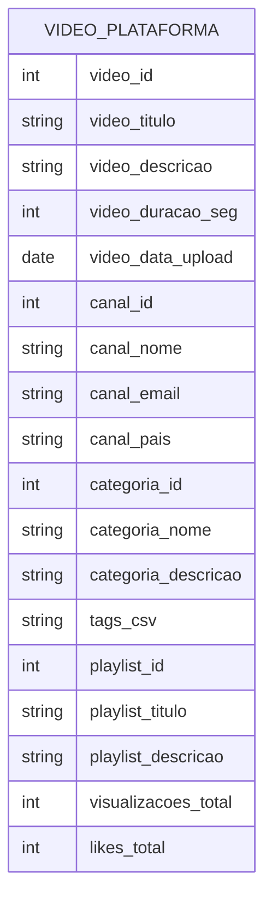

# Prova Presencial — Banco de Dados 1 (SENAC)
**Curso:** Ciência da Computação — 2º semestre  
**Disciplina:** Banco de Dados 1  
**Duração:** 2h  
**Data:** 17/09/2025  
**Valor total:** 10,0 pontos

## Instruções Gerais
- Responda **à caneta** (azul ou preta).
- Entregue a folha com **nome completo e RA**.
- É permitido apenas **material impresso** (sem dispositivos eletrônicos).
- Onde solicitado, **justifique** escolhas de chaves e restrições.
- Use notação clara para: **superchave, chave candidata, chave primária e chave composta**.

---

## Exercício 1 — Modelagem Relacional: Catálogo de Cards (5,0 pts)

### Contexto

Um **jogo de cartas colecionável** (TCG — *Trading Card Game*) é um tipo de jogo em que os jogadores montam baralhos a partir de uma coleção de cartas individuais. Cada carta tem características próprias — nome, tipo, texto de regra, raridade — e é impressa em diferentes **edições** ao longo dos anos, podendo ter ilustrações e disponibilidades distintas por edição.

Uma plataforma digital quer catalogar todas as cartas do jogo e permitir que usuários **registrem suas coleções** — quais cartas possuem, em qual edição e em qual quantidade. O sistema também deve registrar **listas de desejos** (cartas que o usuário quer adquirir) e permitir que usuários **avaliem** cartas com nota e comentário.

Considere o seguinte conjunto de regras de negócio do sistema:

- Uma **carta** tem nome, tipo (ex.: criatura, feitiço, terreno), subtipo opcional, texto de regra e raridade.
- A **raridade** de uma carta pode ser: comum, incomum, rara ou mítica.
- Uma carta pode pertencer a **uma ou mais edições**. Cada vez que uma carta é impressa em uma edição, ela recebe um número de coleção e pode ter uma ilustração diferente.
- Uma **edição** tem código, nome completo, data de lançamento e número total de cartas.
- Um **usuário** possui nome, e-mail e data de cadastro.
- Um usuário pode **registrar** quantas cópias possui de uma carta em uma edição específica.
- Um usuário pode **adicionar** cartas à sua lista de desejos, registrando prioridade (alta, média ou baixa).
- Um usuário pode **avaliar** uma carta com nota (1 a 5) e um comentário opcional. Cada usuário avalia cada carta no máximo uma vez.

### Requisitos

1. **Tabelas e atributos** — modele o esquema com **mínimo de 5 tabelas** e **mínimo de 5 campos por tabela**, cobrindo as entidades e relacionamentos descritos acima.
2. **Relacionamentos** — identifique e represente os relacionamentos **1:N** e **N:M** com suas cardinalidades.
3. **Chaves** — para cada tabela, indique:
   - A **chave primária (PK)**, simples ou composta, com justificativa.
   - As **chaves estrangeiras (FK)**.
   - Ao menos uma **superchave não-mínima** e uma **chave candidata alternativa** (quando existirem) por tabela.
4. **Restrições** — indique restrições relevantes: `NOT NULL`, `UNIQUE`, `CHECK`, domínios e valores permitidos.

### Entregáveis

- Lista das **tabelas** com atributos e tipos (pseudotipos são aceitos).
- Indicação clara de **PK**, **FK** e demais restrições por campo.
- Identificação de **superchaves** e **chaves candidatas** com justificativa curta (2–3 linhas por tabela).
- Representação do **modelo relacional** — pode ser em formato textual/tabela; diagrama opcional.

### Critérios de Avaliação (5,0 pts)

| Critério | Pontos |
|---|---|
| Cobertura correta do cenário: tabelas e atributos (≥ 5 tabelas, ≥ 5 campos cada) | 1,5 |
| Relacionamentos e cardinalidades corretas | 1,5 |
| Identificação de chaves (super, candidatas, PK, composta, FK) com justificativa | 1,5 |
| Clareza, organização e restrições aplicadas | 0,5 |

---

## Exercício 2 — Normalização: Sistema de Vídeos (5,0 pts)

### Contexto

Uma equipe de desenvolvimento criou, de forma apressada, o banco de dados de uma plataforma de compartilhamento de vídeos. Todo o sistema foi modelado em **uma única tabela desnormalizada**, reproduzida abaixo:

```
VIDEO_PLATAFORMA(
  video_id,
  video_titulo,
  video_descricao,
  video_duracao_seg,
  video_data_upload,
  canal_id,
  canal_nome,
  canal_email,
  canal_pais,
  categoria_id,
  categoria_nome,
  categoria_descricao,
  tags_csv,               -- exemplo: "tecnologia;review;smartphone"
  playlist_id,
  playlist_titulo,
  playlist_descricao,
  visualizacoes_total,    -- contagem total de views do vídeo
  likes_total             -- contagem total de likes do vídeo
)
```

**Observações sobre o esquema:**

- Um **canal** pode publicar vários vídeos; cada vídeo pertence a exatamente um canal.
- Cada vídeo pertence a exatamente **uma categoria**, mas uma categoria agrupa muitos vídeos.
- Um vídeo pode ter **múltiplas tags**, armazenadas concatenadas em `tags_csv`.
- Um vídeo pode pertencer a **uma playlist** (ou a nenhuma). Uma playlist pertence a um canal.
- `visualizacoes_total` e `likes_total` são contagens derivadas que a equipe decidiu armazenar diretamente.

### Tarefas

1. **Identifique os problemas** do esquema atual — aponte anomalias de inserção, remoção e atualização com exemplos concretos usando os dados do sistema.

2. **Normalize o esquema até 3FN**, criando todas as tabelas necessárias. Para cada etapa da normalização, **justifique qual forma normal está sendo aplicada e por quê** — indique qual problema específico aquela etapa resolve.

3. **Indique PK, FK, UNIQUE e CHECK** relevantes no esquema final.

4. **Desenhe o diagrama** do esquema normalizado em **Mermaid** (`erDiagram`).

5. **Explique brevemente** como a decomposição final elimina cada anomalia identificada no item 1.

### Diagrama do esquema inicial (Mermaid)

> Apenas para referência visual — representa o estado desnormalizado de partida.



### Critérios de Avaliação (5,0 pts)

| Critério | Pontos |
|---|---|
| Identificação das anomalias com exemplos concretos | 1,0 |
| Normalização correta até 3FN com justificativa de cada etapa | 2,0 |
| Esquema final com PK, FK, UNIQUE e CHECK corretos | 1,0 |
| Diagrama Mermaid correto e coerente com o esquema final | 1,0 |

---

## BÔNUS (2,0 pts) — Modelo Entidade-Relacionamento (MER)

**Objetivo:** Para **cada exercício**, elabore um diagrama ER completo identificando:

- Entidades, atributos e relacionamentos
- Cardinalidades (1:1, 1:N, N:M) e participação (total/parcial)
- Atributos-chave, atributos multivalorados e atributos derivados (quando presentes)
- Entidades fracas e entidades-associação (quando aplicável)
