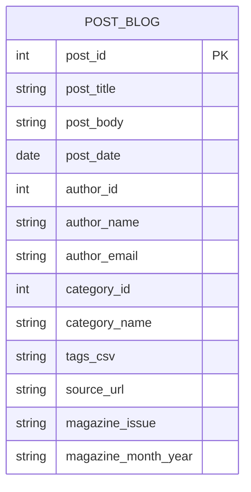

# Prova Presencial — Banco de Dados 1 (SENAC)  
**Curso:** Ciência da Computação — 2º semestre  
**Disciplina:** Banco de Dados 1  
**Duração:** 2h  
**Data:** 17/09/2025  
**Valor total:** 10,0 pontos

## Instruções Gerais
- Responda **à caneta** (azul ou preta).  
- Entregue a folha com **nome completo e RA**.  
- É permitido apenas **material impresso** (sem dispositivos eletrônicos).  
- Onde solicitado, **justifique** escolhas de chaves e restrições.  
- Use notação clara para: **superchave, chave candidata, chave primária e chave composta**.

---

## Exercício 1 — Modelagem Relacional do “Duolingo” (5,0 pts)

### Contexto (Cenário)
Uma plataforma de aprendizado de idiomas oferece **cursos** compostos por **unidades (skills)**; cada unidade contém **lições** com **exercícios** (p. ex., múltipla escolha, completar frase, ouvir e transcrever).  
Usuários podem se **inscrever** em cursos, acumulam **XP**, mantêm **streak diária**, e cada tentativa de exercício registra **acerto/erro**, **tempo gasto** e **data/hora**.  
Cursos têm **idioma de ensino** (ex.: pt-BR) e **idioma-alvo** (ex.: en-US). Há **badges** que são concedidas ao atingir metas (p. ex., “7 dias de streak”, “1000 XP”); usuários podem **seguir** outros usuários.

### Requisitos (o que você deve identificar e modelar)
1. **Tabelas e atributos** (mínimo **5 tabelas** e **5 campos** por tabela) para cobrir:
   - Usuários, Cursos, Unidades/Skills, Lições, Exercícios, Inscrições, Tentativas, Idiomas, Badges, Seguidores (escolha um subconjunto suficiente).
2. **Relacionamentos** (1:N, N:M quando aplicável) e **cardinalidades**.
3. **Chaves**: superchaves, chaves candidatas, chave primária (PK), chaves compostas quando existirem, e chaves estrangeiras (FK).
4. **Restrições** de atributos (ex.: NOT NULL, UNIQUE, domínios, faixas min–max, checagens lógicas).
5. **Regras de integridade** (ex.: um Curso deve referenciar um idioma de ensino e um idioma-alvo distintos).

### Entregáveis
- Lista das **tabelas** com **atributos** e **tipos** (pode ser pseudotipo).
- Indicação clara de **PK**, **FK** e Campos
- Identificação de **superchaves** e **chaves candidatas** por tabela (texto curto).
- Desenho do **modelo relacional** (pode ser textual/tabela; diagrama opcional).

### Critérios de Avaliação (5,0 pts)
- (1,5) Cobertura correta do cenário com tabelas e atributos (≥5/5).  
- (1,5) Relacionamentos e cardinalidades corretas.  
- (1,5) Identificação de chaves (super, candidatas, PK, compostas) com justificativa.
- (0,5) Clareza e organização.

---

## Exercício 2 — Normalização de um “Blog PCMag” Simplificado (5,0 pts)

### Esquema **inicial** (com problemas)
Considere a tabela única abaixo, usada para posts, autores, categorias e tags (denormalizada):

```
POST_BLOG(
  post_id, post_title, post_body, post_date,
  author_id, author_name, author_email,
  category_id, category_name,
  tags_csv,          -- exemplo: "hardware;review;gpu"
  source_url, magazine_issue, magazine_month_year
)
```

**Observações:**
- Um post pode ter **múltiplas tags** (armazenadas em `tags_csv`).  
- Um autor pode escrever **vários posts**.  
- Uma categoria pode conter **vários posts**.  
- Alguns posts fazem parte de uma **edição da revista** (`magazine_issue`, `magazine_month_year`), outros não.

### Tarefas
1. **Identifique anomalias** de inserção/atualização/remoção e **dependências funcionais** prováveis.  
2. **Normalize** o esquema até **3FN** (ou **BCNF**, se possível), **criando as tabelas necessárias** (autores, categorias, tags, posts, ponte Post–Tag, edições da revista).  
3. Indique **PKs, FKs, UNIQUE** e quaisquer **CHECK** relevantes.  
4. Desenhe um **diagrama** (Mermaid) do esquema **normalizado**.  
5. Explique brevemente **como sua decomposição elimina as anomalias**.

### Diagrama do esquema **inicial** (Mermaid)
> Apenas para referência visual do problema (uma tabela “tudo em um”):


---
BÔNUS (2,0 pts) — Modelo Entidade-Relacionamento (MER)

Objetivo: Para cada exercício, elabore um diagrama ER completo, identificando entidades, atributos, relacionamentos, cardinalidades (1:1, 1:N, N:M) e participação (total/parcial). Quando apropriado, identifique atributos-chave, atributos multivalorados/derivados, entidades fracas e entidades-associação.
