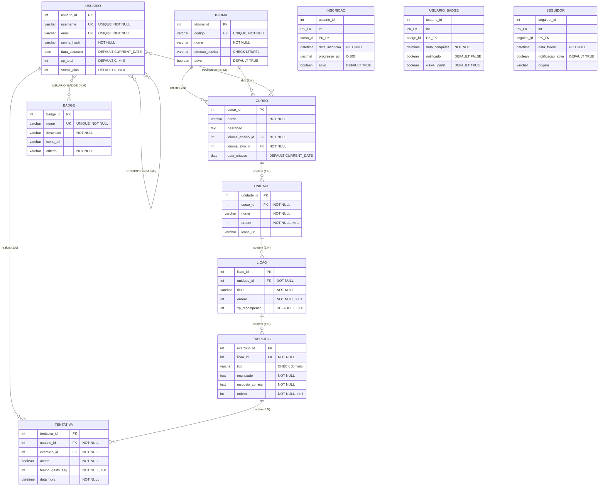
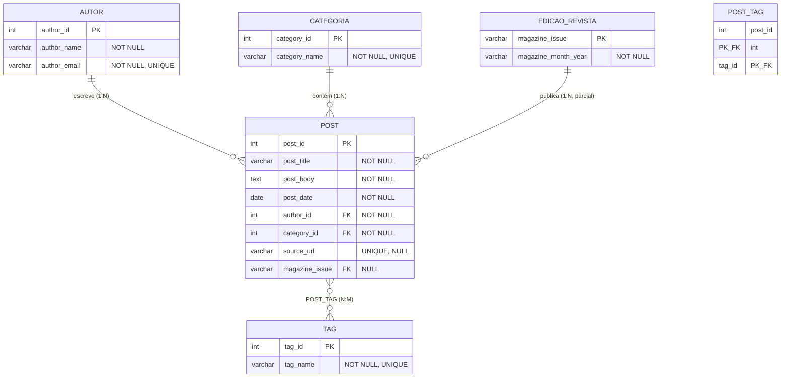
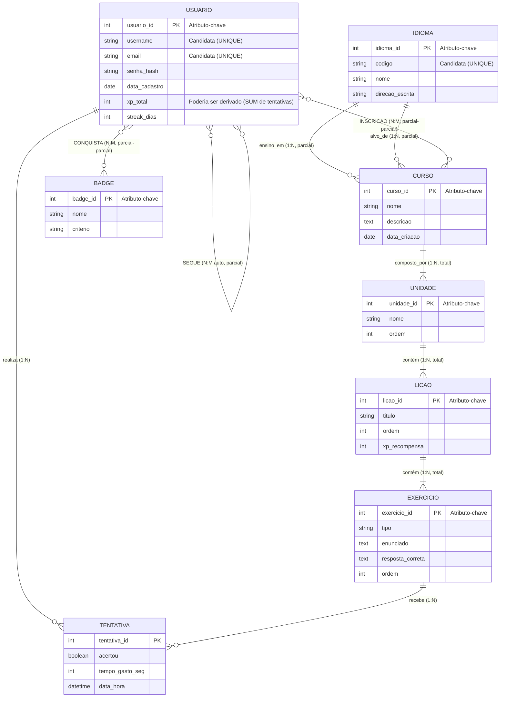
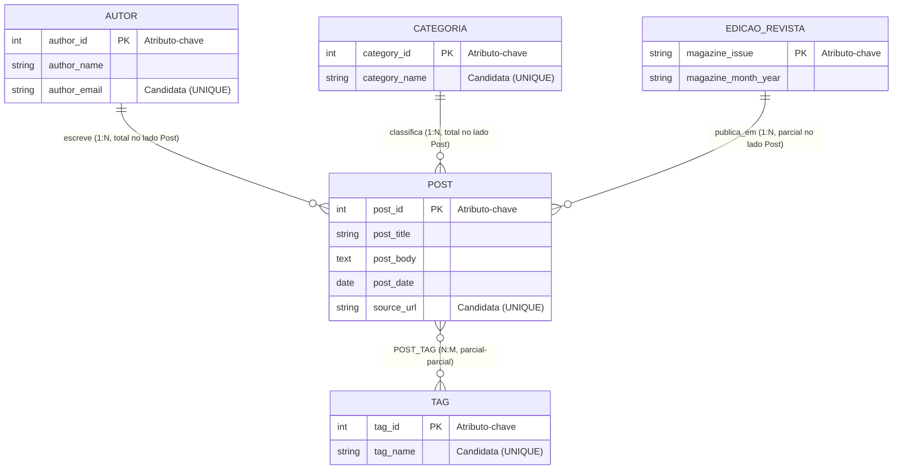

# Resolução — Prova Presencial de Banco de Dados 1 (SENAC)

**Disciplina:** Banco de Dados 1  
**Data da prova:** 17/09/2025  
**Gabarito preparado pelo professor**

---

## Exercício 1 — Modelagem Relacional do "Duolingo" (5,0 pts)

### 1.1 Tabelas, Atributos e Tipos

> **Convenção:** 🔑 = PK | 🔗 = FK | ✱ = NOT NULL

---

#### Tabela `IDIOMA`

| Atributo       | Tipo          | Restrições              |
|----------------|---------------|-------------------------|
| 🔑 idioma_id   | INT           | PK, AUTO_INCREMENT      |
| codigo         | VARCHAR(10)   | NOT NULL, UNIQUE (ex.: `pt-BR`, `en-US`) |
| nome           | VARCHAR(60)   | NOT NULL                |
| direcao_escrita| VARCHAR(3)    | NOT NULL, CHECK IN (`LTR`,`RTL`) |
| ativo          | BOOLEAN       | NOT NULL, DEFAULT TRUE  |

**Chaves:**
- **Superchaves:** {idioma_id}, {codigo}, {idioma_id, codigo}, {idioma_id, nome}, …  
- **Chaves candidatas:** {idioma_id}, {codigo}  
- **Chave primária:** {idioma_id} — surrogate numérica, estável para FKs  
- *Justificativa:* `codigo` também é candidata (UNIQUE), mas preferimos a surrogate para evitar FKs textuais.

---

#### Tabela `USUARIO`

| Atributo         | Tipo          | Restrições                        |
|------------------|---------------|-----------------------------------|
| 🔑 usuario_id    | INT           | PK, AUTO_INCREMENT                |
| username         | VARCHAR(30)   | NOT NULL, UNIQUE                  |
| email            | VARCHAR(120)  | NOT NULL, UNIQUE                  |
| senha_hash       | VARCHAR(255)  | NOT NULL                          |
| data_cadastro    | DATE          | NOT NULL, DEFAULT CURRENT_DATE    |
| xp_total         | INT           | NOT NULL, DEFAULT 0, CHECK (≥ 0) |
| streak_dias      | INT           | NOT NULL, DEFAULT 0, CHECK (≥ 0) |

**Chaves:**
- **Superchaves:** {usuario_id}, {username}, {email}, {usuario_id, username}, …  
- **Chaves candidatas:** {usuario_id}, {username}, {email}  
- **Chave primária:** {usuario_id}  
- *Justificativa:* `username` e `email` são candidatas (ambas UNIQUE e NOT NULL), mas a surrogate numérica é preferida como PK por estabilidade — usernames e e-mails podem ser alterados pelo usuário.

---

#### Tabela `CURSO`

| Atributo             | Tipo          | Restrições                           |
|----------------------|---------------|--------------------------------------|
| 🔑 curso_id          | INT           | PK, AUTO_INCREMENT                   |
| nome                 | VARCHAR(100)  | NOT NULL                             |
| descricao            | TEXT          | NULL                                 |
| 🔗 idioma_ensino_id  | INT           | NOT NULL, FK → IDIOMA(idioma_id)     |
| 🔗 idioma_alvo_id    | INT           | NOT NULL, FK → IDIOMA(idioma_id)     |
| data_criacao         | DATE          | NOT NULL, DEFAULT CURRENT_DATE       |

**Restrição de integridade (CHECK de tabela):**
```
CHECK (idioma_ensino_id <> idioma_alvo_id)
```
> Um curso **não** pode ter o mesmo idioma de ensino e idioma-alvo.

**Restrição UNIQUE composta:**
```
UNIQUE (idioma_ensino_id, idioma_alvo_id)
```
> Evita cursos duplicados para o mesmo par de idiomas.

**Chaves:**
- **Superchaves:** {curso_id}, {idioma_ensino_id, idioma_alvo_id}, …  
- **Chaves candidatas:** {curso_id}, {idioma_ensino_id, idioma_alvo_id}  
- **Chave primária:** {curso_id}  
- *Justificativa:* A chave composta {idioma_ensino_id, idioma_alvo_id} é candidata pela regra UNIQUE, mas a surrogate é mais prática como PK referenciada por outras tabelas.

---

#### Tabela `UNIDADE` (Skill)

| Atributo         | Tipo          | Restrições                        |
|------------------|---------------|-----------------------------------|
| 🔑 unidade_id    | INT           | PK, AUTO_INCREMENT                |
| 🔗 curso_id      | INT           | NOT NULL, FK → CURSO(curso_id)    |
| nome             | VARCHAR(80)   | NOT NULL                          |
| ordem            | INT           | NOT NULL, CHECK (≥ 1)            |
| icone_url        | VARCHAR(255)  | NULL                              |

**Restrição UNIQUE composta:**
```
UNIQUE (curso_id, ordem)
```
> Dentro de um mesmo curso, não pode haver duas unidades com a mesma posição.

**Chaves:**
- **Superchaves:** {unidade_id}, {curso_id, ordem}, …  
- **Chaves candidatas:** {unidade_id}, {curso_id, ordem}  
- **Chave primária:** {unidade_id}  
- **Chave composta identificada:** {curso_id, ordem} — garante ordenação única por curso.  
- *Justificativa:* A composta é candidata natural (identifica a unidade no contexto do curso), mas preferimos a surrogate para simplificar FKs nas tabelas filhas.

---

#### Tabela `LICAO`

| Atributo       | Tipo          | Restrições                           |
|----------------|---------------|--------------------------------------|
| 🔑 licao_id    | INT           | PK, AUTO_INCREMENT                   |
| 🔗 unidade_id  | INT           | NOT NULL, FK → UNIDADE(unidade_id)   |
| titulo         | VARCHAR(100)  | NOT NULL                             |
| ordem          | INT           | NOT NULL, CHECK (≥ 1)              |
| xp_recompensa  | INT           | NOT NULL, DEFAULT 10, CHECK (> 0)   |

**Restrição UNIQUE composta:** `UNIQUE (unidade_id, ordem)`

**Chaves:**
- **Superchaves:** {licao_id}, {unidade_id, ordem}, …  
- **Chaves candidatas:** {licao_id}, {unidade_id, ordem}  
- **Chave primária:** {licao_id}  
- **Chave composta:** {unidade_id, ordem}

---

#### Tabela `EXERCICIO`

| Atributo         | Tipo          | Restrições                           |
|------------------|---------------|--------------------------------------|
| 🔑 exercicio_id  | INT           | PK, AUTO_INCREMENT                   |
| 🔗 licao_id      | INT           | NOT NULL, FK → LICAO(licao_id)       |
| tipo             | VARCHAR(30)   | NOT NULL, CHECK IN (`multipla_escolha`, `completar_frase`, `ouvir_transcrever`, `traduzir`) |
| enunciado        | TEXT          | NOT NULL                             |
| resposta_correta | TEXT          | NOT NULL                             |
| ordem            | INT           | NOT NULL, CHECK (≥ 1)              |

**Restrição UNIQUE composta:** `UNIQUE (licao_id, ordem)`

**Chaves:**
- **Superchaves:** {exercicio_id}, {licao_id, ordem}, …  
- **Chaves candidatas:** {exercicio_id}, {licao_id, ordem}  
- **Chave primária:** {exercicio_id}  
- **Chave composta:** {licao_id, ordem}

---

#### Tabela `INSCRICAO` *(relacionamento N:M — Usuário ↔ Curso)*

| Atributo           | Tipo          | Restrições                           |
|--------------------|---------------|--------------------------------------|
| 🔑🔗 usuario_id    | INT           | PK, FK → USUARIO(usuario_id)        |
| 🔑🔗 curso_id      | INT           | PK, FK → CURSO(curso_id)            |
| data_inscricao     | DATETIME      | NOT NULL, DEFAULT CURRENT_TIMESTAMP  |
| progresso_pct      | DECIMAL(5,2)  | NOT NULL, DEFAULT 0.00, CHECK (0–100)|
| ativo              | BOOLEAN       | NOT NULL, DEFAULT TRUE               |

**Chaves:**
- **Superchaves:** {usuario_id, curso_id}, {usuario_id, curso_id, data_inscricao}, …  
- **Chave candidata:** {usuario_id, curso_id}  
- **Chave primária (composta):** {usuario_id, curso_id}  
- *Justificativa:* É a chave natural — um usuário se inscreve no máximo uma vez em cada curso. A PK composta materializa o relacionamento N:M.

---

#### Tabela `TENTATIVA`

| Atributo         | Tipo          | Restrições                           |
|------------------|---------------|--------------------------------------|
| 🔑 tentativa_id  | INT           | PK, AUTO_INCREMENT                   |
| 🔗 usuario_id    | INT           | NOT NULL, FK → USUARIO(usuario_id)   |
| 🔗 exercicio_id  | INT           | NOT NULL, FK → EXERCICIO(exercicio_id)|
| acertou          | BOOLEAN       | NOT NULL                             |
| tempo_gasto_seg  | INT           | NOT NULL, CHECK (> 0)               |
| data_hora        | DATETIME      | NOT NULL, DEFAULT CURRENT_TIMESTAMP  |

**Chaves:**
- **Superchaves:** {tentativa_id}, {usuario_id, exercicio_id, data_hora}, …  
- **Chaves candidatas:** {tentativa_id}, {usuario_id, exercicio_id, data_hora}  
- **Chave primária:** {tentativa_id}  
- *Justificativa:* A chave natural {usuario_id, exercicio_id, data_hora} é candidata (um usuário não fará duas tentativas no mesmo exercício no mesmo instante), mas a surrogate é escolhida pela praticidade.

---

#### Tabela `BADGE`

| Atributo       | Tipo          | Restrições                 |
|----------------|---------------|----------------------------|
| 🔑 badge_id    | INT           | PK, AUTO_INCREMENT         |
| nome           | VARCHAR(60)   | NOT NULL, UNIQUE           |
| descricao      | VARCHAR(255)  | NOT NULL                   |
| icone_url      | VARCHAR(255)  | NULL                       |
| criterio       | VARCHAR(255)  | NOT NULL (ex.: "streak >= 7") |

**Chaves:**
- **Superchaves:** {badge_id}, {nome}, …  
- **Chaves candidatas:** {badge_id}, {nome}  
- **Chave primária:** {badge_id}

---

#### Tabela `USUARIO_BADGE` *(relacionamento N:M — Usuário ↔ Badge)*

| Atributo         | Tipo          | Restrições                           |
|------------------|---------------|--------------------------------------|
| 🔑🔗 usuario_id  | INT           | PK, FK → USUARIO(usuario_id)        |
| 🔑🔗 badge_id    | INT           | PK, FK → BADGE(badge_id)            |
| data_conquista   | DATETIME      | NOT NULL, DEFAULT CURRENT_TIMESTAMP  |
| notificado       | BOOLEAN       | NOT NULL, DEFAULT FALSE              |
| visivel_perfil   | BOOLEAN       | NOT NULL, DEFAULT TRUE               |

**Chaves:**
- **Chave primária (composta):** {usuario_id, badge_id}  
- *Justificativa:* Cada badge é concedida no máximo uma vez por usuário.

---

#### Tabela `SEGUIDOR` *(auto-relacionamento N:M — Usuário segue Usuário)*

| Atributo             | Tipo          | Restrições                           |
|----------------------|---------------|--------------------------------------|
| 🔑🔗 seguidor_id     | INT           | PK, FK → USUARIO(usuario_id)        |
| 🔑🔗 seguido_id      | INT           | PK, FK → USUARIO(usuario_id)        |
| data_follow          | DATETIME      | NOT NULL, DEFAULT CURRENT_TIMESTAMP  |
| notificacao_ativa    | BOOLEAN       | NOT NULL, DEFAULT TRUE               |
| origem               | VARCHAR(20)   | NULL (ex.: `busca`, `sugestao`)      |

**Restrição CHECK:**
```
CHECK (seguidor_id <> seguido_id)
```
> Um usuário não pode seguir a si mesmo.

**Chaves:**
- **Chave primária (composta):** {seguidor_id, seguido_id}  
- *Justificativa:* Um usuário segue outro no máximo uma vez.

---

### 1.2 Resumo de Relacionamentos e Cardinalidades

| Relacionamento                  | Cardinalidade | Implementação                  |
|---------------------------------|---------------|--------------------------------|
| IDIOMA → CURSO (ensino)        | 1 : N         | FK `idioma_ensino_id` em CURSO |
| IDIOMA → CURSO (alvo)          | 1 : N         | FK `idioma_alvo_id` em CURSO   |
| CURSO → UNIDADE                | 1 : N         | FK `curso_id` em UNIDADE       |
| UNIDADE → LICAO                | 1 : N         | FK `unidade_id` em LICAO       |
| LICAO → EXERCICIO              | 1 : N         | FK `licao_id` em EXERCICIO     |
| USUARIO ↔ CURSO                | N : M         | Tabela `INSCRICAO`             |
| USUARIO → TENTATIVA ← EXERCICIO| N : M (com atributos) | Tabela `TENTATIVA`    |
| USUARIO ↔ BADGE                | N : M         | Tabela `USUARIO_BADGE`         |
| USUARIO ↔ USUARIO (seguir)     | N : M (auto)  | Tabela `SEGUIDOR`              |

---

### 1.3 Diagrama Relacional (Mermaid ER)



---

### 1.4 Regras de Integridade Adicionais

1. **Idiomas distintos no curso:** `CHECK (idioma_ensino_id <> idioma_alvo_id)` — um curso de "pt-BR → pt-BR" não faz sentido.
2. **Auto-seguimento proibido:** `CHECK (seguidor_id <> seguido_id)`.
3. **Integridade referencial em cascata:** ao remover um CURSO, deve-se definir política (CASCADE ou RESTRICT) para UNIDADE, LICAO, EXERCICIO, INSCRICAO.
4. **Domínio de tipo de exercício:** `CHECK (tipo IN ('multipla_escolha','completar_frase','ouvir_transcrever','traduzir'))`.
5. **Progresso válido:** `CHECK (progresso_pct BETWEEN 0.00 AND 100.00)`.

---
---

## Exercício 2 — Normalização do "Blog PCMag" (5,0 pts)

### 2.1 Anomalias Identificadas

#### Anomalia de Inserção
- **Não é possível cadastrar um autor novo** sem que ele tenha publicado pelo menos um post (pois `author_id`/`author_name`/`author_email` vivem dentro de `POST_BLOG`).
- **Não é possível criar uma categoria** sem associá-la a um post.
- **Não é possível cadastrar uma edição da revista** que ainda não tenha posts publicados.

#### Anomalia de Atualização
- Se o autor "João Silva" muda de e-mail, é preciso **atualizar N linhas** (todas onde `author_id` daquele autor aparece). Se alguma linha for esquecida, o banco fica **inconsistente**.
- Renomear uma categoria exige alterar `category_name` em **todos os posts** daquela categoria.

#### Anomalia de Remoção
- Se o **único post** de um autor for removido, **perdemos os dados do autor** (nome, e-mail) — eles só existiam naquela linha.
- Se todos os posts de uma edição da revista forem excluídos, **perdemos os dados da edição**.

#### Violação da 1FN
- O campo `tags_csv` armazena **múltiplos valores** em uma única célula (ex.: `"hardware;review;gpu"`), violando a atomicidade da Primeira Forma Normal.

---

### 2.2 Dependências Funcionais (DFs)

Considerando `POST_BLOG` com chave primária `{post_id}`:

| DF | Dependência Funcional                                  | Observação                          |
|----|--------------------------------------------------------|-------------------------------------|
| 1  | `post_id → post_title, post_body, post_date, author_id, category_id, source_url, magazine_issue` | DF da chave primária |
| 2  | `author_id → author_name, author_email`               | **DF parcial/transitiva** — author_id não é chave de POST_BLOG |
| 3  | `category_id → category_name`                          | **DF transitiva**                   |
| 4  | `magazine_issue → magazine_month_year`                  | **DF transitiva** — a edição determina o mês/ano |
| 5  | `author_email → author_id, author_name`                | E-mail é chave candidata de autor   |
| 6  | `post_id ↛ tags_csv` (multivalorado)                   | Viola 1FN — não é DF funcional simples |

**Problema central:** As DFs 2, 3 e 4 são transitivas (`post_id → author_id → author_name`), o que viola a 3FN. O campo `tags_csv` viola a 1FN.

---

### 2.3 Esquema Normalizado (3FN / BCNF)

#### Tabela `AUTOR`

| Atributo     | Tipo          | Restrições                  |
|--------------|---------------|-----------------------------|
| 🔑 author_id | INT           | PK                          |
| author_name  | VARCHAR(120)  | NOT NULL                    |
| author_email | VARCHAR(150)  | NOT NULL, UNIQUE            |

> **BCNF?** Sim. Toda DF tem o lado esquerdo como superchave ({author_id} ou {author_email}).

---

#### Tabela `CATEGORIA`

| Atributo       | Tipo          | Restrições                  |
|----------------|---------------|-----------------------------|
| 🔑 category_id | INT           | PK                          |
| category_name  | VARCHAR(80)   | NOT NULL, UNIQUE            |

> **BCNF?** Sim. {category_id} e {category_name} são ambas candidatas.

---

#### Tabela `EDICAO_REVISTA`

| Atributo            | Tipo          | Restrições                     |
|---------------------|---------------|--------------------------------|
| 🔑 magazine_issue   | VARCHAR(20)   | PK                             |
| magazine_month_year | VARCHAR(7)    | NOT NULL, CHECK (formato `MM/YYYY` ou `YYYY-MM`) |

> **BCNF?** Sim. `magazine_issue → magazine_month_year` e `magazine_issue` é a chave.  
> *Nota:* Vários issues podem cair no mesmo mês (edição especial), então `magazine_month_year` não determina `magazine_issue`.

---

#### Tabela `TAG`

| Atributo   | Tipo          | Restrições                    |
|------------|---------------|-------------------------------|
| 🔑 tag_id  | INT           | PK, AUTO_INCREMENT            |
| tag_name   | VARCHAR(50)   | NOT NULL, UNIQUE              |

> Resolve a violação de 1FN: cada tag é agora uma **linha atômica**.

---

#### Tabela `POST`

| Atributo           | Tipo          | Restrições                              |
|--------------------|---------------|-----------------------------------------|
| 🔑 post_id         | INT           | PK                                      |
| post_title         | VARCHAR(200)  | NOT NULL                                |
| post_body          | TEXT          | NOT NULL                                |
| post_date          | DATE          | NOT NULL                                |
| 🔗 author_id       | INT           | NOT NULL, FK → AUTOR(author_id)         |
| 🔗 category_id     | INT           | NOT NULL, FK → CATEGORIA(category_id)   |
| source_url         | VARCHAR(500)  | NULL, UNIQUE                            |
| 🔗 magazine_issue  | VARCHAR(20)   | NULL, FK → EDICAO_REVISTA(magazine_issue)|

> **`magazine_issue` é NULL** quando o post não pertence a nenhuma edição impressa — participação **parcial**.  
> **BCNF?** Sim. A única DF não-trivial parte de `{post_id}`, que é superchave.

---

#### Tabela `POST_TAG` *(ponte N:M)*

| Atributo       | Tipo   | Restrições                     |
|----------------|--------|--------------------------------|
| 🔑🔗 post_id   | INT    | PK, FK → POST(post_id)        |
| 🔑🔗 tag_id    | INT    | PK, FK → TAG(tag_id)          |

> **PK composta:** {post_id, tag_id}  
> **BCNF?** Sim. Não há DFs além da chave composta completa.

---

### 2.4 Diagrama do Esquema Normalizado (Mermaid)



---

### 2.5 Como a Decomposição Elimina as Anomalias

| Anomalia original | Como é eliminada |
|-------------------|------------------|
| **Inserção de autor sem post** | Agora `AUTOR` é uma tabela independente — podemos inserir um autor a qualquer momento, sem precisar de um post. |
| **Inserção de categoria sem post** | `CATEGORIA` é independente — mesmo raciocínio. |
| **Inserção de edição sem post** | `EDICAO_REVISTA` é independente. |
| **Atualização do e-mail do autor** | O e-mail existe em **uma única linha** na tabela `AUTOR`. Uma atualização basta; zero risco de inconsistência. |
| **Atualização do nome da categoria** | Idem — `category_name` está em uma única linha em `CATEGORIA`. |
| **Remoção do último post de um autor** | O autor **continua existindo** na tabela `AUTOR`, pois seus dados não dependem mais da existência de posts. |
| **Remoção de todos os posts de uma edição** | A edição **permanece** em `EDICAO_REVISTA`. |
| **Violação da 1FN (tags_csv)** | O campo multivalorado `tags_csv` foi substituído pela tabela `TAG` + tabela ponte `POST_TAG`, garantindo **atomicidade** — cada tag é um registro individual. |
| **DFs transitivas (violação de 3FN)** | `author_id → author_name, author_email` agora vive em `AUTOR`; `category_id → category_name` vive em `CATEGORIA`; `magazine_issue → magazine_month_year` vive em `EDICAO_REVISTA`. Cada tabela resultante está em BCNF. |

**Conclusão:** O esquema decomposto está em **BCNF** — toda dependência funcional não-trivial tem uma superchave do lado esquerdo, e não há atributos multivalorados. A decomposição é **sem perda de junção** (lossless join) e **preserva dependências**.

---
---

## BÔNUS (2,0 pts) — Modelo Entidade-Relacionamento (MER)

### Bônus A — MER do Exercício 1 (Duolingo)



**Observações sobre o MER:**

- **Participação total (||--|{):** Unidade *deve* pertencer a um Curso; Lição *deve* pertencer a uma Unidade; Exercício *deve* pertencer a uma Lição.
- **Participação parcial (||--o{):** Um Idioma pode existir sem ser usado em nenhum Curso (ainda); um Usuário pode existir sem inscrições.
- **Atributo derivado:** `xp_total` do Usuário poderia ser calculado a partir da soma de XP das tentativas corretas (SUM de `xp_recompensa` das lições completadas). Na modelagem, armazena-se por desempenho, mas conceitualmente é derivado.
- **Entidade associativa:** `TENTATIVA` é uma entidade associativa entre USUARIO e EXERCICIO — carrega atributos próprios (`acertou`, `tempo_gasto_seg`, `data_hora`).
- **Auto-relacionamento:** `SEGUE` é um relacionamento N:M recursivo na entidade USUARIO, com papéis distintos (seguidor / seguido).

---

### Bônus B — MER do Exercício 2 (Blog PCMag)



**Observações sobre o MER:**

- **Participação total de POST em AUTOR e CATEGORIA:** Todo post *deve* ter exatamente um autor e uma categoria (FK NOT NULL).
- **Participação parcial de POST em EDICAO_REVISTA:** Nem todo post pertence a uma edição impressa (FK NULLable) — apenas os que saíram na revista.
- **Relacionamento N:M (POST ↔ TAG):** Substituiu o atributo multivalorado `tags_csv` da tabela original. No MER conceitual, `tags_csv` seria modelado como **atributo multivalorado** na entidade POST; ao passar para o modelo relacional, é decomposto na tabela ponte `POST_TAG`.
- **Nenhuma entidade fraca:** Todas as entidades possuem chave própria (identificador natural ou surrogate).

---

*Fim do gabarito.*
